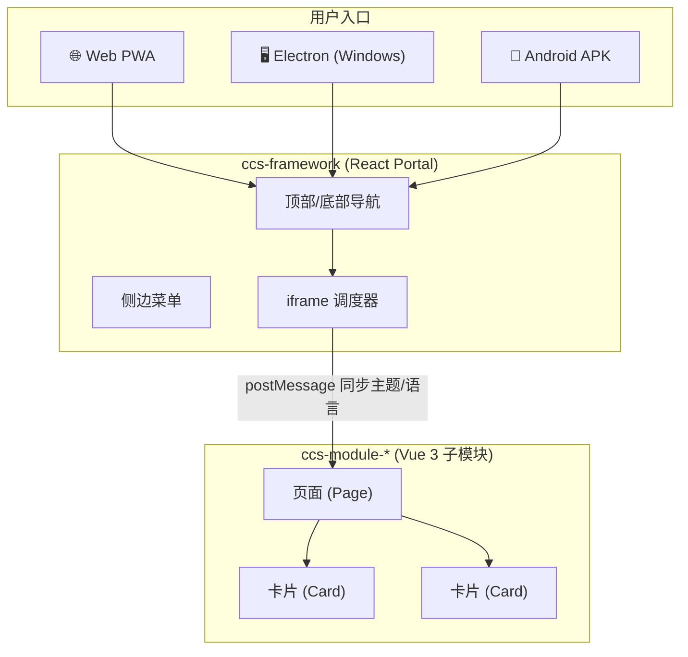

# CCPS（基建-云解决方案）前端工程项目

React 主应用作为 Portal（`ccs-framework`），Vue 3 子应用作为业务模块（`ccs-module-*`），iframe 负责模块嵌入与调度，`ccs` CLI 负责模块、页面、卡片生成与多端构建（Web / Electron / Android）。

---

## 目录

- [1. 项目概述](#1-项目概述)
- [2. 安装与前置条件](#2-安装与前置条件)
- [3. 命令参考](#3-命令参考)
- [4. 创建子模块、页面和卡片](#4-创建子模块页面和卡片)
- [5. 在 ccs-framework 中挂接菜单](#5-在-ccs-framework-中挂接菜单)
- [6. ccs-module-test 示例模块介绍](#6-ccs-module-test-示例模块介绍)
- [7. 开发环境测试](#7-开发环境测试)
- [8. Web 构建与 PWA 测试](#8-web-构建与-pwa-测试)
- [9. Electron 构建与测试](#9-electron-构建与测试)
- [10. Android 构建与测试](#10-android-构建与测试)
- [11. 注意事项与常见问题](#11-注意事项与常见问题)

---

## 1. 项目概述

### 1.1 简介

CCPS（Construction Cloud Platform Solution）是一个面向基建行业的云管理平台，支持在多端（Web 端、Windows 端、Android 端）在线或离线运行。项目采用 Monorepo 架构，由以下核心部分组成：

| 组成部分   | 路径                   | 技术栈                               | 说明                                                   |
| ---------- | ---------------------- | ------------------------------------ | ------------------------------------------------------ |
| 框架主应用 | `apps/ccs-framework`   | React 19 + TypeScript + Tailwind CSS | Portal 壳，提供全局导航、主题切换、多语言、iframe 调度 |
| 子模块示例 | `apps/ccs-module-test` | Vue 3 + TypeScript + Tailwind CSS    | 演示模块，包含考勤打卡、离线文档、离线拍照三个示例页面 |
| Android 壳 | `apps/ccs-android`     | Capacitor 8                          | 将 Web 构建产物打包为 Android APK                      |
| CLI 工具   | `packages/cli`         | TypeScript + Commander               | `ccs` 命令行，用于创建模块/页面/卡片和多端构建         |
| 运行时库   | `packages/runtime`     | TypeScript                           | 为子模块提供 iframe 通信、主题/语言同步等运行时能力    |
| 共享库     | `packages/shared`      | TypeScript                           | 共享类型、事件常量、工具函数                           |
| UI 库      | `packages/ui-vue`      | Vue 3                                | 为子模块提供 CardGrid、卡片注册等 UI 组件              |
| 上传服务   | `packages/upload`      | Node.js                              | 离线拍照上传接收端（演示用）                           |

### 1.2 架构概览



- **框架主应用** 通过 iframe 嵌入子模块页面，使用 `postMessage` 同步主题（亮色/暗色）和语言（中文/英文）
- **每个子模块** 是一个独立的 Vue 3 SPA，拥有自己的路由、卡片注册和页面配置
- **构建时**，子模块产物输出到 `dist/web/ccs-module-xxx/` 目录，与框架产物同源部署

---

## 2. 安装与前置条件

### 2.1 必需环境

| 工具        | 最低版本 | 说明                                |
| ----------- | -------- | ----------------------------------- |
| **Node.js** | 22+      | JavaScript 运行时                   |
| **pnpm**    | 10+      | 包管理器（项目使用 pnpm workspace） |

安装 pnpm：

```bash
npm install -g pnpm@latest
```

### 2.2 克隆并安装

```bash
git clone <repo-url>
cd ccs-monorepo
pnpm install
```

### 2.3 可选环境（按需安装）

| 构建目标     | 额外要求                                                        |
| ------------ | --------------------------------------------------------------- |
| **Electron** | 无需额外安装（electron 和 electron-builder 通过 npm 安装）      |
| **Android**  | Android SDK + JDK 21（详见 [第 10 节](#10-android-构建与测试)） |

### 2.4 环境变量

在项目根目录下创建 `.env` 文件：

```bash
# 以下为 Android 构建相关（可选）
# ANDROID_HOME=C:/Users/xxx/AppData/Local/Android/Sdk
# JAVA_HOME=C:/Program Files/Eclipse Adoptium/jdk-21
```

---

## 3. 命令参考

所有命令在项目根目录 `ccs-monorepo/` 下执行。

### 3.1 开发与构建

| 命令                  | 说明                                                                 |
| --------------------- | -------------------------------------------------------------------- |
| `pnpm dev`            | 同时启动框架（端口 3000）和所有 `ccs-module-*` 子模块的 dev server   |
| `pnpm dev:ssl`        | 同上，但框架启用 HTTPS（用于测试需要 SSL 的功能如 OPFS）             |
| `pnpm build`          | 通过 Turbo 并行构建所有包（`turbo run build`）                       |
| `pnpm build:web`      | 构建 Web 产物到 `dist/web/`（含框架 + 所有子模块 + Service Worker）  |
| `pnpm build:electron` | 构建 Electron 桌面应用到 `dist/electron/`（依赖 `build:web` 先执行） |
| `pnpm build:android`  | 构建 Android APK 到 `dist/android/`（依赖 `build:web` 先执行）       |

### 3.2 预览

| 命令              | 说明                                                           |
| ----------------- | -------------------------------------------------------------- |
| `pnpm preview`    | 以 HTTPS 模式预览 `dist/web/` 构建产物（端口 3000）            |
| `pnpm doc`        | 启动离线文档 HTTP 服务器（端口 8081）                          |
| `pnpm doc:ssl`    | 启动离线文档 HTTPS 服务器（端口 8080，用于测试 OPFS 离线文档） |
| `pnpm upload`     | 启动离线拍照上传 HTTP 服务器（端口 8082）                      |
| `pnpm upload:ssl` | 启动离线拍照上传 HTTPS 服务器（端口 8083）                     |

### 3.3 CLI 脚手架

| 命令                                             | 说明                          |
| ------------------------------------------------ | ----------------------------- |
| `pnpm ccs create module <name>`                  | 创建子模块，自动分配 dev 端口 |
| `pnpm ccs create page <name> --module <module>`  | 在指定模块下创建页面          |
| `pnpm ccs create card <name> --module <module>`  | 在指定模块下创建卡片          |
| `pnpm ccs build web`                             | 等同 `pnpm build:web`         |
| `pnpm ccs build electron`                        | 等同 `pnpm build:electron`    |
| `pnpm ccs build android`                         | 等同 `pnpm build:android`     |
| `pnpm ccs build cards <names> --module <module>` | 按需构建指定模块的指定卡片    |

### 3.4 其他

| 命令        | 说明                     |
| ----------- | ------------------------ |
| `pnpm lint` | 运行 TypeScript 类型检查 |
| `pnpm test` | 运行 vitest 测试         |

---

## 4. 创建子模块、页面和卡片

### 4.1 创建子模块

```bash
# 创建一个名为 ccs-module-demo 的子模块（端口自动分配，从 5174 开始）
pnpm ccs create module ccs-module-demo

# 或指定端口
pnpm ccs create module ccs-module-demo --port 5175

# 指定模块标题
pnpm ccs create module ccs-module-demo --title "演示模块"
```

**生成的文件结构：**

```
apps/ccs-module-demo/
├── package.json          # 子模块包配置，dev 端口已自动设置
├── tsconfig.json
├── vite.config.ts        # Vite 构建配置
├── vite.card.config.ts   # 卡片独立构建配置
├── index.html
├── scripts/
│   └── build-cards.mjs   # 卡片构建脚本
└── src/
    ├── App.vue           # 模块根组件
    ├── main.ts           # 入口文件
    ├── styles.css
    ├── router/
    │   └── index.ts      # 路由配置（含 ccs-cli:route 标记）
    ├── pages/
    │   └── home/
    │       └── HomePage.vue  # 默认首页
    ├── cards/
    │   └── index.ts      # 卡片注册表（含 ccs-cli:card-import 和 ccs-cli:card-register 标记）
    ├── stores/
    └── i18n/
```

创建后需要重新安装依赖：

```bash
pnpm install
```

### 4.2 创建页面

```bash
# 在 ccs-module-demo 下创建 user 页面
pnpm ccs create page user --module ccs-module-demo

# 指定页面标题
pnpm ccs create page user --module ccs-module-demo --title "用户管理"
```

**生成的文件：**

```
src/pages/user/
├── UserPage.vue          # 页面组件
└── config.ts             # 页面卡片布局配置
```

CLI 会自动在 `src/router/index.ts` 的 `// ccs-cli:route` 标记前插入路由定义：

```typescript
{
  path: '/user',
  name: 'User',
  component: () => import('../pages/user/UserPage.vue')
},
```

### 4.3 创建卡片

```bash
# 在 ccs-module-demo 下创建 user-stat 卡片
pnpm ccs create card user-stat --module ccs-module-demo

# 指定卡片标题
pnpm ccs create card user-stat --module ccs-module-demo --title "用户统计"
```

**生成的文件：**

```
src/cards/
└── UserStatCard.vue      # 卡片组件
```

CLI 会自动在 `src/cards/index.ts` 中插入：

- `// ccs-cli:card-import` 前 → 插入 `import` 语句
- `// ccs-cli:card-register` 前 → 插入注册条目

### 4.4 页面配置卡片布局

在页面的 `config.ts` 中引用卡片，使用 12 栅格响应式布局：

```typescript
// src/pages/user/config.ts
import type { CardDefinition } from '@ccs/ui-vue';

export default {
  cards: [
    {
      type: 'user-stat', // 对应卡片注册表中的 key
      layout: {
        colSpan: { base: 12, md: 6 }, // 移动端全宽，桌面端半宽
        rowSpan: 2
      }
    },
    {
      type: 'user-table',
      layout: {
        colSpan: { base: 12, md: 6 },
        rowSpan: 4
      }
    }
  ]
} satisfies CardDefinition[];
```

### 4.5 重新安装并启动

```bash
pnpm install
pnpm dev
```

---

## 5. 在 ccs-framework 中挂接菜单

创建子模块后，需要在 `apps/ccs-framework/src/lib/menu1~7.ts` 中新增菜单项，才能在框架侧边栏中看到入口。

### 5.1 添加菜单项

编辑 `apps/ccs-framework/src/lib/menu1~7.ts`，在返回的数组中添加：

```typescript
// 在返回的数组中新增一个顶层菜单项
{
  id: 'ccs-module-demo',
  title: isZh ? '子模块示例' : 'Submodule Demo',
  icon: HardHat,
  children: [
    {
      id: 'ccs-module-demo-home',
      title: isZh ? '首页' : 'Home Page',
      url: 'ccs-module-demo',           // 匹配 iframe 模块路由
      icon: Shield
    },
    {
      id: 'ccs-module-demo-user',
      title: isZh ? '用户管理' : 'User Management',
      url: 'ccs-module-demo/user',      // 模块内页面路由
      icon: Users
    },
    {
      id: 'ccs-module-demo-admin',
      title: isZh ? '后台管理' : 'Admin Management',
      url: 'ccs-module-demo/admin',
      icon: LineChart
    }
  ]
},
```

### 5.2 URL 路由规则

| 菜单 URL                 | 行为                                       |
| ------------------------ | ------------------------------------------ |
| `ccs-module-demo`        | 加载模块首页（`/` 路由）                   |
| `ccs-module-demo/user`   | 加载模块的 `/user` 页面                    |
| `https://...` 开头的 URL | 在 iframe 中直接加载外部页面               |
| `#xxx` 开头的 URL        | 框架内部路由（如 `#welcome` 跳转到欢迎页） |

- **开发模式**：框架 Vite dev server 将 `/ccs-module-demo` 代理到子模块 dev server
- **生产模式**：直接请求同源路径 `dist/web/ccs-module-demo/`

### 5.3 图标

菜单图标使用 [Lucide React](https://lucide.dev/icons/) 图标库，在 `menu1~7.ts` 中 import 需要的图标即可。

---

## 6. ccs-module-test 示例模块介绍

`apps/ccs-module-test` 是一个演示子模块，包含三个完整的功能页面，展示了离线优先（Offline-First）的工程现场场景。

### 6.1 考勤打卡（Attendance）

- **页面路由**：`/attendance`
- **包含卡片**：
  - `attendance-title` — 页面标题
  - `attendance-geolocation` — 地理位置获取与展示
  - `attendance-shift` — 班次信息与打卡操作
  - `attendance-list` — 打卡记录列表
- **功能演示**：获取 GPS 定位、打卡状态管理、本地存储打卡记录

### 6.2 离线文档（Offline Docs）

- **页面路由**：`/offline-docs`
- **包含卡片**：
  - `offline-docs-title` — 页面标题与文档服务器地址配置
  - `offline-docs-cache` — 缓存管理与存储统计
  - `offline-docs-list` — 文档列表，支持预览/下载/离线打开
- **功能演示**：
  - 从远程文档服务器获取文档列表
  - 将文档下载到 **OPFS**（Origin Private File System）实现离线访问
  - 支持 PDF、图片、Office 文档的离线预览
  - 文档更新检测与增量下载
- **⚠️ 重要**：OPFS 仅在安全上下文（HTTPS 或 localhost）中可用

### 6.3 离线拍照（Offline Photo）

- **页面路由**：`/offline-photo`
- **包含卡片**：
  - `offline-photo-title` — 页面标题与上传服务器地址配置
  - `offline-photo-cache` — 缓存统计
  - `offline-photo-camera` — 拍照采集
  - `offline-photo-upload` — 离线照片上传
  - `offline-photo-list` — 本地照片列表
- **功能演示**：
  - 调用摄像头拍照
  - 照片本地缓存（OPFS / IndexedDB）
  - 离线照片队列上传（网络恢复后自动上传）
  - 上传进度追踪

---

## 7. 开发环境测试

### 7.1 启动开发服务器

```bash
# 标准 HTTP 模式（考勤打卡可用）
pnpm dev

# HTTPS 模式（考勤打卡/离线文档/离线拍照 OPFS 可用）
pnpm dev:ssl
```

- 框架主应用：`https://localhost:3000`（SSL 模式）或 `http://localhost:3000`
- 子模块 `ccs-module-test`：`http://localhost:5174`

### 7.2 启动文档和上传服务

测试离线文档和离线拍照功能，需要分别启动文档服务和上传服务：

```bash
# 离线文档服务（HTTP，端口 8081）
pnpm doc

# 离线文档服务（HTTPS，端口 8080 —— 开发测试推荐使用）
pnpm doc:ssl

# 拍照上传服务（HTTP，端口 8082）
pnpm upload

# 拍照上传服务（HTTPS，端口 8083）
pnpm upload:ssl
```

### 7.3 测试离线文档页面

1. 启动框架 + 模块：`pnpm dev:ssl`
2. 启动文档服务器：`pnpm doc:ssl`
3. 在浏览器中打开 `https://localhost:3000`
4. 首页点击 EHS 管理，再点击任意项目，随后在右边菜单展开子模块示例，点击离线文档
5. 在页面顶部配置文档地址：`https://localhost:8080/`
6. 点击文档列表中的「下载」按钮
7. 下载完成后，断开文档服务器，验证离线打开功能

> **为什么需要 SSL？** OPFS（Origin Private File System）是浏览器提供的本地文件存储 API，仅在安全上下文（HTTPS 或 localhost）中可用。`pnpm dev` 使用 HTTP，离线文档的 OPFS 功能将不可用，需使用 `pnpm dev:ssl`。

### 7.4 测试离线拍照页面

1. 启动框架 + 模块：`pnpm dev:ssl`
2. 启动上传服务：`pnpm upload:ssl`
3. 在浏览器中打开 `https://localhost:3000`
4. 首页点击 EHS 管理，再点击任意项目，随后在右边菜单展开子模块示例，点击离线拍照
5. 在页面中部配置上传地址：`https://localhost:8083/upload`
6. 点击拍照按钮采集照片（浏览器会请求摄像头权限）
7. 照片将缓存到本地，点击上传按钮发送到上传服务
8. 上传成功的照片将出现在项目根目录的 `documents/` 文件夹里

### 7.5 测试考勤打卡页面

考勤打卡功能不依赖 SSL，可直接在 HTTP 模式下测试：

1. 启动 `pnpm dev`
2. 首页点击 EHS 管理，再点击任意项目，随后在右边菜单展开子模块示例，点击考勤打卡
3. 点击获取位置（浏览器会请求 GPS 权限）
4. 进行打卡操作，查看打卡记录

---

## 8. Web 构建与 PWA 测试

### 8.1 构建 Web 应用

```bash
pnpm build:web
```

构建产物位于 `dist/web/`，包含：

- 框架主应用 SPA
- 所有 `ccs-module-*` 子模块产物
- Service Worker（基于 Workbox 的离线缓存策略）
- `manifest.json`（PWA Web App Manifest）

### 8.2 以 HTTPS 预览

由于 PWA 的 Service Worker 和 OPFS 需要安全上下文，构建产物预览必须使用 HTTPS：

```bash
pnpm preview
```

该命令调用 `vite.preview.config.mjs`，启用 `@vitejs/plugin-basic-ssl` 自签名证书。

浏览器访问 `https://localhost:3000`。

> **首次访问会提示证书不安全**，点击「高级」→「继续访问」即可。

### 8.3 测试 PWA 功能

在 `pnpm preview` 启动的 HTTPS 环境下：

1. **Service Worker 注册**：
   - 打开 DevTools → Application → Service Workers
   - 确认 SW 已注册并激活
   - 确认 precache 已缓存所有静态资源

2. **离线访问测试**：
   - 首次正常加载页面
   - 在 DevTools → Network 中勾选「Offline」
   - 刷新页面，确认仍能正常加载（包括子模块 iframe）

3. **PWA 安装测试**：
   - 浏览器地址栏右侧出现安装图标
   - 点击安装，确认 PWA 以独立窗口运行

### 8.4 预览模式下测试三个示例页面

与开发模式类似，但在预览模式下还需要启动文档和上传服务：

```bash
# 终端 1：预览构建产物
pnpm preview

# 终端 2：文档服务（HTTPS）
pnpm doc:ssl

# 终端 3：上传服务（HTTPS）
pnpm upload:ssl
```

- **离线文档页面**：文档地址配置为 `https://localhost:8080/`
- **离线拍照页面**：上传地址配置为 `https://localhost:8083/upload`

> ⚠️ **预览模式注意事项**：
>
> - 预览服务和文档/上传服务使用不同的自签名证书，浏览器可能对每个源都需要手动信任
> - Service Worker 的 `maximumFileSizeToCacheInBytes` 默认为 10MB，超大文件不会被预缓存
> - 构建产物中的 `sw.js` 会使用本地 workbox 库（而非 CDN），确保离线时可用

---

## 9. Electron 构建与测试

### 9.1 构建 Windows 桌面应用

```bash
pnpm build:electron
```

此命令执行两个步骤：

1. `build:web` — 先构建 Web 产物
2. `ccs-framework build:electron` — 用 electron-vite + electron-builder 打包

构建产物位于 `dist/electron/`，包含：

- `CCPS Setup x.x.x.exe` — NSIS 安装程序
- `win-unpacked/` — 解压即用的绿色版

### 9.2 安装与运行

直接进入 `dist/electron/win-unpacked/` 双击 `CCPS.exe` 运行，或者点击 `dist/electron/CCPS Setup x.x.x.exe` 安装。

### 9.3 Electron 中的离线文档

Electron 主进程内置了离线文档管理能力（`electron/offline-docs.ts`）：

- 文档下载到用户数据目录（`app.getPath('userData')/offline-docs/`），而非 OPFS
- 支持断点续传和更新检测
- 通过 IPC 与渲染进程通信，提供 `ccsElectron.offlineDocs` API
- 预加载脚本（`electron/preload.ts`）通过 `contextBridge` 暴露安全的 API

**测试方法**：

1. 构建并启动 Electron 应用
2. 导航到离线文档页面
3. 配置文档地址（支持 HTTP，Electron 不受 HTTPS 限制）
4. 下载文档并验证离线打开

### 9.4 Electron 特殊处理

- **外部链接**：非 blob 的外部 URL 使用系统默认浏览器打开（`shell.openExternal`）
- **Blob URL**：离线缓存的文档以 blob URL 打开，允许在新窗口中查看
- **地图链接**：考勤打卡中的地图链接由主进程处理
- **自签名证书**：Electron 下载文档时自动接受自签名证书（开发环境）

---

## 10. Android 构建与测试

### 10.1 前置条件

在 Windows 上构建 Android APK 需要：

| 工具            | 版本要求 | 下载地址                                                                                                                        |
| --------------- | -------- | ------------------------------------------------------------------------------------------------------------------------------- |
| **Android SDK** | API 34+  | [Android Studio](https://developer.android.com/studio) 或 [命令行工具](https://developer.android.com/studio#command-line-tools) |
| **JDK**         | 21       | [Eclipse Temurin](https://adoptium.net/) 或 [Oracle JDK](https://www.oracle.com/java/technologies/downloads/)                   |

安装后配置环境变量：

```bash
# 示例（Windows PowerShell）
$env:ANDROID_HOME = "C:\Users\<用户名>\AppData\Local\Android\Sdk"
$env:JAVA_HOME = "C:\Program Files\Java\jdk-21"

# 或在系统环境变量中永久设置
```

可通过以下可选环境变量自定义配置：

| 环境变量                        | 说明             | 默认值                  |
| ------------------------------- | ---------------- | ----------------------- |
| `CCS_ANDROID_SDK`               | Android SDK 路径 | 自动检测 `ANDROID_HOME` |
| `CCS_ANDROID_APPLICATION_ID`    | 应用 ID          | `com.huawei.ccps`       |
| `CCS_ANDROID_APP_NAME`          | 应用名称         | `基建-云解决方案`       |
| `CCS_ANDROID_KEYSTORE_FILE`     | 签名密钥库路径   | 无（使用 debug 签名）   |
| `CCS_ANDROID_KEYSTORE_ALIAS`    | 密钥别名         | —                       |
| `CCS_ANDROID_KEYSTORE_PASSWORD` | 密钥密码         | —                       |

### 10.2 构建 APK

```bash
pnpm build:android
```

构建产物位于 `dist/android/`：

- `ccps-debug.apk`（无签名配置时）
- `ccps-release.apk`（配置了签名密钥时）

### 10.3 安装到真机

**方法一：adb 安装**

```bash
adb install dist/android/ccps-debug.apk
```

**方法二：直接传输 APK**

- 将 APK 文件传输到手机
- 在手机上打开文件管理器，点击 APK 安装
- 可能需要开启「允许安装未知来源应用」

### 10.4 安装到模拟器

1. 启动 Android 模拟器（通过 Android Studio AVD Manager）
2. 拖放 APK 文件到模拟器窗口
3. 或使用 adb：`adb install dist/android/ccps-debug.apk`

### 10.5 Android 环境测试注意事项

#### ⚠️ 必须使用 HTTP，不能使用 HTTPS

在 Android 环境中测试离线文档和离线拍照功能时，**文档地址和上传地址必须使用 HTTP**：

| 服务     | Android 中使用的地址              |
| -------- | --------------------------------- |
| 离线文档 | `http://<你的电脑IP>:8081/`       |
| 拍照上传 | `http://<你的电脑IP>:8082/upload` |

**原因**：项目使用的本地开发证书是自签名的，Android 系统不信任自签名证书。虽然 `capacitor.config.ts` 中配置了 `androidScheme: 'https'` 和 `cleartext: true`（允许明文 HTTP），但文档/上传服务如果使用 HTTPS 自签名证书将无法在 Android WebView 中正常访问。

#### 测试步骤

1. **确保手机和电脑在同一局域网**
2. **启动 HTTP 服务**（不要用 SSL 版本）：

```bash
# 终端 1：文档服务（HTTP）
pnpm doc

# 终端 2：上传服务（HTTP）
pnpm upload
```

3. **获取电脑 IP 地址**：

```bash
# Windows PowerShell
ipconfig
# 查找 IPv4 地址，例如 192.168.1.100
```

4. **在 Android 应用中配置**：
   - 离线文档地址：`http://192.168.1.100:8081/`
   - 拍照上传地址：`http://192.168.1.100:8082/upload`

5. **验证功能**：
   - 文档下载和离线打开（使用 Capacitor Filesystem 插件）
   - 拍照（使用 Capacitor Camera 插件）
   - 照片上传（支持离线队列）

> ⚠️ **Android 文件打开**：Android 中打开文档使用 Capacitor 的 `FileOpener` 插件，而非浏览器 OPFS。离线文档在 Android 中通过 `Capacitor Filesystem` 存储到应用私有目录。

### 10.6 仅准备项目（不构建 APK）

如果只想同步 Web 资源到 Android 项目而不构建 APK：

```bash
# 在 apps/ccs-android 目录下
pnpm cap:sync
```

或在根目录设置环境变量：

```bash
$env:CCS_ANDROID_PREPARE_ONLY = "1"
pnpm build:android
```

---

## 11. 注意事项与常见问题

### 11.1 Windows 管理员权限

#### pnpm build:android 首次构建

在 Windows 上首次运行 `pnpm build:android` 时，Capacitor 会通过 Gradle 下载 Android 构建工具和依赖。**Gradle wrapper（gradlew.bat）在首次运行时可能需要管理员权限**来创建符号链接或写入特定目录。

如果遇到权限错误，请**以管理员身份运行终端**再执行构建。

#### electron-builder 签名工具

在 Windows 上构建 Electron 应用时，`electron-builder` 为了替换应用图标，需要下载 `winCodeSign` 工具包。解压过程涉及**创建符号链接**，只有管理员才有此权限。

如果遇到 `winCodeSign` 相关错误：

- **以管理员身份运行终端**执行 `pnpm build:electron`
- 或手动下载 winCodeSign 并放置到对应缓存目录

### 11.2 Electron 镜像加速

如果下载 Electron 或 electron-builder 二进制文件较慢，可设置镜像环境变量：

```bash
$env:ELECTRON_MIRROR = "https://npmmirror.com/mirrors/electron/"
$env:ELECTRON_BUILDER_BINARIES_MIRROR = "https://npmmirror.com/mirrors/electron-builder-binaries/"
```

这些已在 `scripts/build-electron.mjs` 中默认配置了国内镜像。

### 11.3 端口占用

默认端口分配：

| 服务                       | 端口                                           |
| -------------------------- | ---------------------------------------------- |
| 框架 dev server            | 3000                                           |
| ccs-module-test dev server | 5174                                           |
| 新模块 dev server          | 5175 起自动递增                                |
| 文档服务（HTTP）           | 8081                                           |
| 文档服务（HTTPS）          | 8080                                           |
| 上传服务（HTTP）           | 8082                                           |
| 上传服务（HTTPS）          | 8083                                           |
| 预览服务                   | 3000（可通过 `CCS_PREVIEW_PORT` 环境变量修改） |

如果端口被占用，可设置环境变量覆盖或手动修改对应的 `package.json`。

### 11.4 自签名证书

项目使用 `@vitejs/plugin-basic-ssl` 生成自签名证书用于本地 HTTPS 开发。证书文件位于 `documents/cert.pem` 和 `documents/key.pem`。

- **浏览器**：首次访问需要手动信任
- **Electron**：主进程配置了 `rejectUnauthorized: false`，自动接受
- **Android**：系统不信任自签名证书，请使用 HTTP 访问本地服务

### 11.5 PWA Service Worker

- Service Worker 使用 Workbox 生成，配置在 `apps/ccs-framework/src/sw.js`
- `build:web` 构建时会自动执行 `injectManifest` 注入预缓存清单
- SW 注册在 `apps/ccs-framework/src/main.tsx` 中
- 子模块的 iframe 导航也会被 SW 拦截并提供缓存响应

### 11.6 主题与多语言

- 框架顶部工具栏提供主题切换（亮色/暗色）和语言切换（中文/英文）
- 切换后通过 iframe `postMessage`（`SYNC_STATE` 事件）同步到所有已加载的子模块
- 子模块通过 `@ccs/runtime` 的 `bindIframeMessageHandlers` 接收并应用

### 11.7 Monorepo 包管理

项目使用 pnpm workspace：

- `apps/*` — 应用（框架、子模块、Android 壳）
- `packages/*` — 共享库（CLI、runtime、shared、ui-vue、upload）
- 构建使用 Turborepo 编排（`turbo.json`）

工作空间依赖通过 `workspace:*` 协议引用，如：

```json
"@ccs/runtime": "workspace:*",
"@ccs/shared": "workspace:*"
```

### 11.8 清理构建

```bash
# 清理所有构建产物
rm -rf dist/

# 清理特定模块
pnpm --filter ccs-module-test clean
```

### 11.9 故障排除速查表

| 问题                       | 解决方案                                             |
| -------------------------- | ---------------------------------------------------- |
| `pnpm dev` 启动失败        | 检查端口 3000 是否被占用；运行 `pnpm install`        |
| 离线文档 OPFS 不可用       | 使用 `pnpm dev:ssl` 启动 HTTPS 模式                  |
| PWA 不显示安装按钮         | 确保使用 `pnpm preview`（HTTPS）访问                 |
| Electron 构建失败          | 以管理员身份运行；检查磁盘空间                       |
| Android 构建失败           | 检查 `ANDROID_HOME` 和 `JAVA_HOME`；以管理员身份运行 |
| Android 中无法访问文档服务 | 使用 HTTP 而非 HTTPS；确认手机与电脑同一网络         |
| 子模块页面 404             | 确认已运行 `pnpm install`；确认菜单 URL 正确         |
| Service Worker 未激活      | 确保 HTTPS 环境；检查 DevTools Application 面板      |

---

## 技术栈

| 层级   | 技术                                               |
| ------ | -------------------------------------------------- |
| 框架   | React 19 + TypeScript                              |
| 子模块 | Vue 3 + TypeScript + Pinia + Vue Router + Vue I18n |
| 样式   | Tailwind CSS 4                                     |
| 构建   | Vite + electron-vite + Turborepo                   |
| 桌面端 | Electron + electron-builder                        |
| 移动端 | Capacitor 8                                        |
| PWA    | Workbox 7                                          |
| 包管理 | pnpm workspace                                     |
| CLI    | Commander.js                                       |
