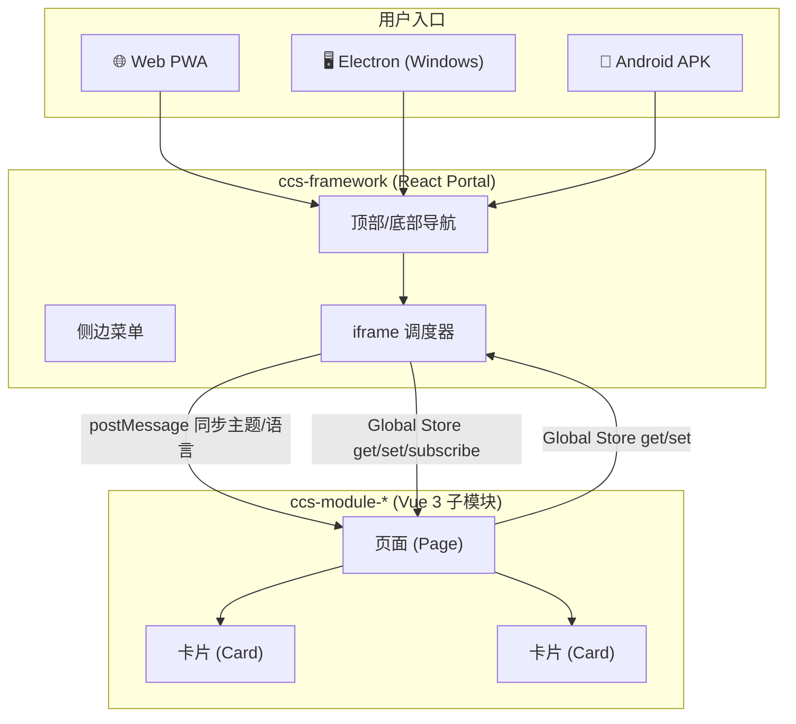
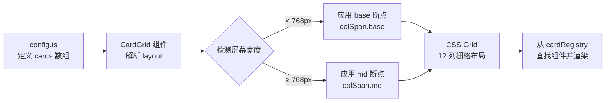
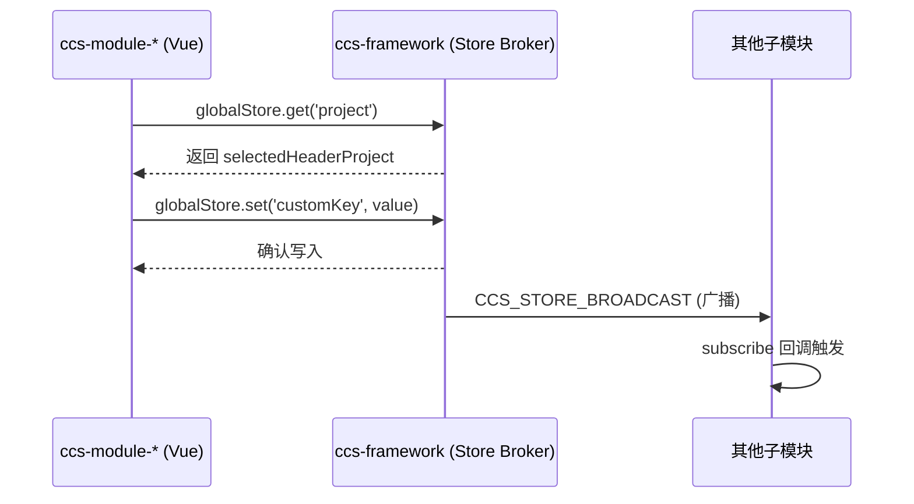
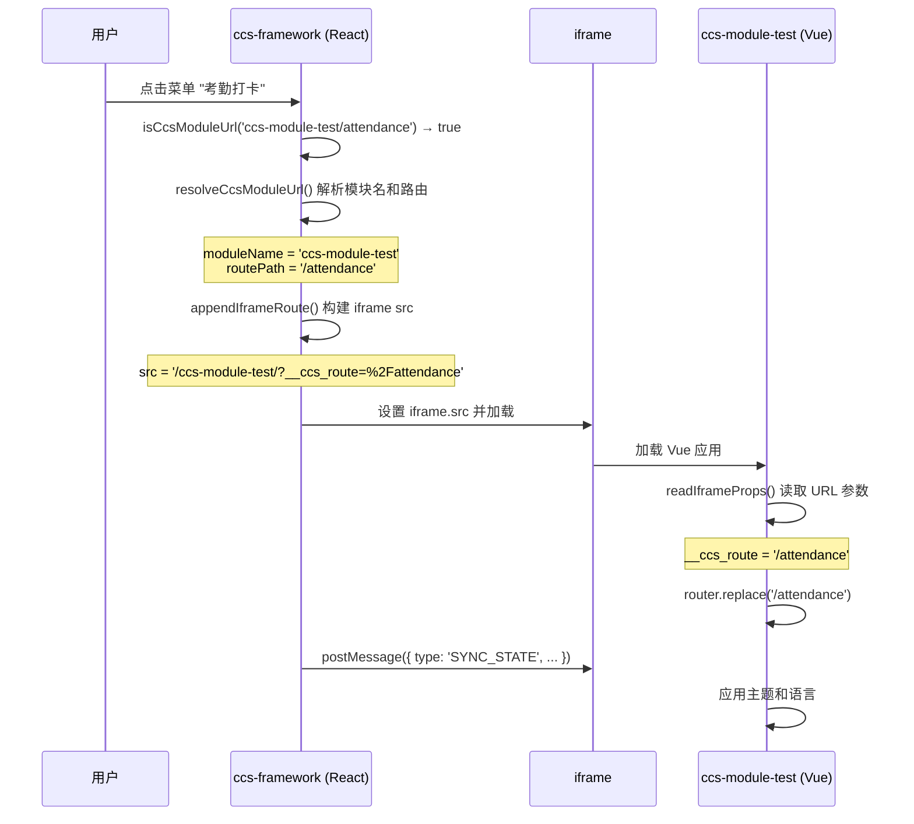

# CCPS（基建-云解决方案）前端工程项目

React 主应用作为 Portal（`ccs-framework`），Vue 3 子应用作为业务模块（`ccs-module-*`），iframe 负责模块嵌入与调度，`ccs` CLI 负责模块、页面、卡片生成与多端构建（Web / Electron / Android）。

> #### ⚠️ 重要警告
>
> **`apps/ccs-framework`（Portal 框架主应用）的代码由 Google AI Studio 生成，请勿手动修改！（除非是为了调试页面而修改菜单链接）**
>
> 该工程的 Portal 页面、导航、布局、样式等全部由 AI 辅助构建。对 Portal 的任何功能迭代或界面调整，均须通过 **Google AI Studio** 完成。AI Studio 导出代码时采用**全量替换**策略——即对该工程任何文件的手动修改将在下一次 AI 导出时被**完全覆盖**，无法保留。
>
> **正确做法**：
>
> - 需要新增菜单项或调整 Portal 功能 → 在 Google AI Studio 中描述需求或修改代码，由其生成代码后导出替换
> - 需要创建业务模块/页面/卡片 → 使用 `pnpm ccs create` 命令在 `apps/ccs-module-*` 中创建（**子模块可以自由修改**）
> - 需要修改共享库（`packages/*`）或构建脚本（`scripts/*`）→ 可以自由修改
>
> **受影响范围**：`apps/ccs-framework/` 下的所有文件和目录，包括 `src/`、`electron/`、`public/` 等。

---

## 目录

- [1. 项目概述](#1-项目概述)
  - [1.1 简介](#11-简介)
  - [1.2 架构概览](#12-架构概览)
- [2. 安装与前置条件](#2-安装与前置条件)
  - [2.1 必需环境](#21-必需环境)
  - [2.2 克隆并安装](#22-克隆并安装)
  - [2.3 可选环境（按需安装）](#23-可选环境按需安装)
  - [2.4 环境变量](#24-环境变量)
- [3. 命令参考](#3-命令参考)
  - [3.1 开发与构建](#31-开发与构建)
  - [3.2 预览](#32-预览)
  - [3.3 CLI 脚手架](#33-cli-脚手架)
  - [3.4 其他](#34-其他)
- [4. 创建子模块、页面和卡片](#4-创建子模块页面和卡片)
  - [4.1 创建子模块](#41-创建子模块)
  - [4.2 创建页面](#42-创建页面)
  - [4.3 创建卡片](#43-创建卡片)
  - [4.4 页面配置卡片布局](#44-页面配置卡片布局)
  - [4.5 重新安装并启动](#45-重新安装并启动)
  - [4.6 添加国际化资源](#46-添加国际化资源)
  - [4.7 主题切换与语种切换](#47-主题切换与语种切换)
  - [4.8 全局状态管理（Global Store）](#48-全局状态管理global-store)
- [5. 在 ccs-framework 中挂接菜单](#5-在-ccs-framework-中挂接菜单)
  - [5.1 添加菜单项](#51-添加菜单项)
  - [5.2 URL 路由规则](#52-url-路由规则)
  - [5.3 图标](#53-图标)
  - [5.4 iframe 加载与路由原理](#54-iframe-加载与路由原理)
- [附录 A：documents 目录详解](#附录-adocuments-目录详解)
  - [A.1 目录结构](#a1-目录结构)
  - [A.2 offline-documents.json —— 离线文档清单](#a2-offline-documentsjson--离线文档清单)
  - [A.3 文档更新检测机制](#a3-文档更新检测机制)
  - [A.4 自签名证书](#a4-自签名证书)
- [6. 多端运行说明](#6-多端运行说明)
  - [6.1 iOS（苹果手机）使用方式](#61-ios苹果手机使用方式)
  - [6.2 鸿蒙（HarmonyOS）使用方式](#62-鸿蒙harmonyos使用方式)
  - [6.3 平板电脑 / 折叠屏手机自适应](#63-平板电脑--折叠屏手机自适应)
- [7. ccs-module-test 示例模块介绍](#7-ccs-module-test-示例模块介绍)
  - [7.1 考勤打卡（Attendance）](#71-考勤打卡attendance)
  - [7.2 离线文档（Offline Docs）](#72-离线文档offline-docs)
  - [7.3 离线拍照（Offline Photo）](#73-离线拍照offline-photo)
- [8. 开发环境测试](#8-开发环境测试)
  - [8.1 启动开发服务器](#81-启动开发服务器)
  - [8.2 启动文档和上传服务](#82-启动文档和上传服务)
  - [8.3 测试离线文档页面](#83-测试离线文档页面)
  - [8.4 测试离线拍照页面](#84-测试离线拍照页面)
  - [8.5 测试考勤打卡页面](#85-测试考勤打卡页面)
- [9. Web 构建与 PWA 测试](#9-web-构建与-pwa-测试)
  - [9.1 构建 Web 应用](#91-构建-web-应用)
  - [9.2 以 HTTPS 预览](#92-以-https-预览)
  - [9.3 测试 PWA 功能](#93-测试-pwa-功能)
  - [9.4 预览模式下测试三个示例页面](#94-预览模式下测试三个示例页面)
- [10. Electron 构建与测试](#10-electron-构建与测试)
  - [10.1 构建 Windows 桌面应用](#101-构建-windows-桌面应用)
  - [10.2 安装与运行](#102-安装与运行)
  - [10.3 Electron 中的离线文档](#103-electron-中的离线文档)
  - [10.4 Electron 特殊处理](#104-electron-特殊处理)
- [11. Android 构建与测试](#11-android-构建与测试)
  - [11.1 前置条件](#111-前置条件)
  - [11.2 构建 APK](#112-构建-apk)
  - [11.3 安装到真机](#113-安装到真机)
  - [11.4 安装到模拟器](#114-安装到模拟器)
  - [11.5 Android 环境测试注意事项](#115-android-环境测试注意事项)
  - [11.6 仅准备项目（不构建 APK）](#116-仅准备项目不构建-apk)
- [12. 注意事项与常见问题](#12-注意事项与常见问题)
  - [12.1 Windows 管理员权限](#121-windows-管理员权限)
  - [12.2 Electron 镜像加速](#122-electron-镜像加速)
  - [12.3 端口占用](#123-端口占用)
  - [12.4 自签名证书](#124-自签名证书)
  - [12.5 PWA Service Worker](#125-pwa-service-worker)
  - [12.6 主题与多语言](#126-主题与多语言)
  - [12.7 Monorepo 包管理](#127-monorepo-包管理)
  - [12.8 清理构建](#128-清理构建)
  - [12.9 故障排除速查表](#129-故障排除速查表)

---

## 1. 项目概述

### 1.1 简介

CCPS（Construction Cloud Platform Solution）是一个面向基建行业的云管理平台，支持在多端（Web 端、Windows 端、Android 端）在线或离线运行。项目采用 Monorepo 架构，由以下核心部分组成：

| 组成部分   | 路径                   | 技术栈                               | 说明                                                                                   |
| ---------- | ---------------------- | ------------------------------------ | -------------------------------------------------------------------------------------- |
| 框架主应用 | `apps/ccs-framework`   | React 19 + TypeScript + Tailwind CSS | Portal 壳（⚠️ **AI 生成，禁止手动修改**），提供全局导航、主题切换、多语言、iframe 调度 |
| 子模块示例 | `apps/ccs-module-test` | Vue 3 + TypeScript + Tailwind CSS    | 演示模块，包含考勤打卡、离线文档、离线拍照三个示例页面                                 |
| Android 壳 | `apps/ccs-android`     | Capacitor 8                          | 将 Web 构建产物打包为 Android APK                                                      |
| CLI 工具   | `packages/cli`         | TypeScript + Commander               | `ccs` 命令行，用于创建模块/页面/卡片和多端构建                                         |
| 运行时库   | `packages/runtime`     | TypeScript                           | 为子模块提供 iframe 通信、主题/语言同步等运行时能力                                    |
| 共享库     | `packages/shared`      | TypeScript                           | 共享类型、事件常量、工具函数、全局状态管理（Global Store）                             |
| UI 库      | `packages/ui-vue`      | Vue 3                                | 为子模块提供 CardGrid、卡片注册等 UI 组件                                              |
| 上传服务   | `packages/upload`      | Node.js                              | 离线拍照上传接收端（演示用）                                                           |

### 1.2 架构概览



- **框架主应用** 通过 iframe 嵌入子模块页面，使用 `postMessage` 同步主题（亮色/暗色）和语言（中文/英文）
- **全局状态管理**（Global Store）：基于 `postMessage` 的请求-响应 + 广播机制，子模块可主动拉取框架数据（如当前项目）、写入共享数据、订阅变更通知。详见 [4.8 全局状态管理](#48-全局状态管理global-store)
- **每个子模块** 是一个独立的 Vue 3 SPA，拥有自己的路由、卡片注册和页面配置
- **构建时**，子模块产物输出到 `dist/web/ccs-module-xxx/` 目录，与框架产物同源部署

---

## 2. 安装与前置条件

### 2.1 必需环境

| 工具        | 最低版本 | 说明                                |
| ----------- | -------- | ----------------------------------- |
| **Node.js** | 22+      | JavaScript 运行时                   |
| **pnpm**    | 10+      | 包管理器（项目使用 pnpm workspace） |

安装 pnpm：

```bash
npm install -g pnpm@latest
```

### 2.2 克隆并安装

```bash
git clone <repo-url>
cd ccs-monorepo
pnpm install
```

### 2.3 可选环境（按需安装）

| 构建目标     | 额外要求                                                        |
| ------------ | --------------------------------------------------------------- |
| **Electron** | 无需额外安装（electron 和 electron-builder 通过 npm 安装）      |
| **Android**  | Android SDK + JDK 21（详见 [第 11 节](#11-android-构建与测试)） |

### 2.4 环境变量

在项目根目录下创建 `.env` 文件：

```bash
# 以下为 Android 构建相关（可选）
# ANDROID_HOME=C:/Users/xxx/AppData/Local/Android/Sdk
# JAVA_HOME=C:/Program Files/Eclipse Adoptium/jdk-21
```

---

## 3. 命令参考

所有命令在项目根目录 `ccs-monorepo/` 下执行。

### 3.1 开发与构建

| 命令                  | 说明                                                                 |
| --------------------- | -------------------------------------------------------------------- |
| `pnpm dev`            | 同时启动框架（端口 3000）和所有 `ccs-module-*` 子模块的 dev server   |
| `pnpm dev:ssl`        | 同上，但框架启用 HTTPS（用于测试需要 SSL 的功能如 OPFS）             |
| `pnpm build`          | 通过 Turbo 并行构建所有包（`turbo run build`）                       |
| `pnpm build:web`      | 构建 Web 产物到 `dist/web/`（含框架 + 所有子模块 + Service Worker）  |
| `pnpm build:electron` | 构建 Electron 桌面应用到 `dist/electron/`（依赖 `build:web` 先执行） |
| `pnpm build:android`  | 构建 Android APK 到 `dist/android/`（依赖 `build:web` 先执行）       |

### 3.2 预览

| 命令              | 说明                                                           |
| ----------------- | -------------------------------------------------------------- |
| `pnpm preview`    | 以 HTTPS 模式预览 `dist/web/` 构建产物（端口 3000）            |
| `pnpm doc`        | 启动离线文档 HTTP 服务器（端口 8081）                          |
| `pnpm doc:ssl`    | 启动离线文档 HTTPS 服务器（端口 8080，用于测试 OPFS 离线文档） |
| `pnpm upload`     | 启动离线拍照上传 HTTP 服务器（端口 8082）                      |
| `pnpm upload:ssl` | 启动离线拍照上传 HTTPS 服务器（端口 8083）                     |

### 3.3 CLI 脚手架

| 命令                                             | 说明                          |
| ------------------------------------------------ | ----------------------------- |
| `pnpm ccs create module <name>`                  | 创建子模块，自动分配 dev 端口 |
| `pnpm ccs create page <name> --module <module>`  | 在指定模块下创建页面          |
| `pnpm ccs create card <name> --module <module>`  | 在指定模块下创建卡片          |
| `pnpm ccs build web`                             | 等同 `pnpm build:web`         |
| `pnpm ccs build electron`                        | 等同 `pnpm build:electron`    |
| `pnpm ccs build android`                         | 等同 `pnpm build:android`     |
| `pnpm ccs build cards <names> --module <module>` | 按需构建指定模块的指定卡片    |

### 3.4 其他

| 命令        | 说明                     |
| ----------- | ------------------------ |
| `pnpm lint` | 运行 TypeScript 类型检查 |
| `pnpm test` | 运行 vitest 测试         |

---

## 4. 创建子模块、页面和卡片

### 4.1 创建子模块

```bash
# 创建一个名为 ccs-module-demo 的子模块（端口自动分配，从 5174 开始）
pnpm ccs create module ccs-module-demo

# 或指定端口
pnpm ccs create module ccs-module-demo --port 5175

# 指定模块标题
pnpm ccs create module ccs-module-demo --title "演示模块"
```

**生成的文件结构：**

```
apps/ccs-module-demo/
├── package.json          # 子模块包配置，dev 端口已自动设置
├── tsconfig.json
├── vite.config.ts        # Vite 构建配置
├── vite.card.config.ts   # 卡片独立构建配置
├── index.html
├── scripts/
│   └── build-cards.mjs   # 卡片构建脚本
└── src/
    ├── App.vue           # 模块根组件
    ├── main.ts           # 入口文件
    ├── styles.css
    ├── router/
    │   └── index.ts      # 路由配置（含 ccs-cli:route 标记）
    ├── pages/
    │   └── home/
    │       └── HomePage.vue  # 默认首页
    ├── cards/
    │   └── index.ts      # 卡片注册表（含 ccs-cli:card-import 和 ccs-cli:card-register 标记）
    ├── stores/
    └── i18n/
```

创建后需要重新安装依赖：

```bash
pnpm install
```

### 4.2 创建页面

```bash
# 在 ccs-module-demo 下创建 user 页面
pnpm ccs create page user --module ccs-module-demo
```

**生成的文件：**

```
src/pages/user/
├── UserPage.vue          # 页面组件
└── config.ts             # 页面卡片布局配置
```

CLI 会自动在 `src/router/index.ts` 的 `// ccs-cli:route` 标记前插入路由定义：

```typescript
{
  path: '/user',
  name: 'User',
  component: () => import('../pages/user/UserPage.vue')
},
```

### 4.3 创建卡片

```bash
# 在 ccs-module-demo 下创建 user-stat 卡片
pnpm ccs create card user-stat --module ccs-module-demo
```

**生成的文件：**

```
src/cards/
└── UserStatCard.vue      # 卡片组件
```

CLI 会自动在 `src/cards/index.ts` 中插入：

- `// ccs-cli:card-import` 前 → 插入 `import` 语句
- `// ccs-cli:card-register` 前 → 插入注册条目

#### 大型工程实践：目录分层组织

当模块中的页面和卡片数量较多时，建议按**业务子领域**对 `pages/` 和 `cards/` 目录进行分层组织，避免所有页面/卡片平铺在同一级目录下，提升可维护性和可发现性。

**pages 目录分层：**

```
src/pages/
├── home/
│   └── HomePage.vue          # 默认首页
├── attendance/               # 考勤子领域
│   ├── AttendancePage.vue
│   └── config.ts
├── documents/                # 文档子领域
│   ├── DocListPage.vue
│   ├── DocDetailPage.vue
│   └── config.ts
└── settings/                 # 设置子领域
    ├── ProfilePage.vue
    ├── SecurityPage.vue
    └── config.ts
```

**cards 目录分层（一级：按子领域）：**

```
src/cards/
├── index.ts                  # 卡片注册表（汇总所有子领域的卡片）
├── attendance/               # 考勤子领域卡片
│   ├── ShiftCard.vue
│   ├── CheckInCard.vue
│   └── RecordListCard.vue
├── documents/                # 文档子领域卡片
│   ├── DocCacheCard.vue
│   └── DocListCard.vue
└── settings/                 # 设置子领域卡片
    ├── ProfileCard.vue
    └── SecurityCard.vue
```

**cards 目录分层（二级：子领域 + 子页面）：**

当某个子领域的卡片数量非常多时，可在子领域目录下再按**子页面**细分：

```
src/cards/
└── documents/                    # 文档子领域
    ├── list/                     # 文档列表页相关卡片
    │   ├── DocFilterCard.vue
    │   ├── DocTableCard.vue
    │   └── DocStatsCard.vue
    ├── detail/                   # 文档详情页相关卡片
    │   ├── DocPreviewCard.vue
    │   └── DocMetadataCard.vue
    └── cache/                    # 缓存管理页相关卡片
        ├── CacheStatusCard.vue
        └── CacheCleanCard.vue
```

> **注意**：无论 `cards/` 目录嵌套多深，`cards/index.ts` 中的 import 路径需要与实际文件位置保持一致。CLI 的 `pnpm ccs create` 命令默认在 `pages/<name>/` 和 `cards/` 根目录下生成文件，创建后需**手动移动**到对应的子领域目录中，并相应更新路由配置和卡片注册表的 import 路径。

### 4.4 页面配置卡片布局

页面由多个卡片（Card）组成，卡片在一个 **12 栅格响应式布局** 中排列。每个卡片的布局在页面的 `config.ts` 中通过 `cards` 数组配置。

#### 4.4.1 基础配置示例

```typescript
// src/pages/user/config.ts
import type { CardDefinition } from '@ccs/ui-vue';

export default {
  cards: [
    {
      type: 'user-stat', // 对应卡片注册表中的 KEY
      layout: {
        colSpan: { base: 12, md: 6 }, // 列跨度
        rowSpan: 2 // 行跨度（可选，默认 1）
      }
    },
    {
      type: 'user-table',
      layout: {
        colSpan: { base: 12, md: 6 },
        rowSpan: 4
      }
    }
  ]
} satisfies CardDefinition[];
```

#### 4.4.2 `type` —— 卡片类型标识

`type` 的值必须与 **卡片注册表** 中的 KEY 完全一致。卡片注册表定义在模块的 `src/cards/index.ts` 中：

```typescript
// src/cards/index.ts
import { createCardRegistry } from '@ccs/ui-vue';
import UserStatCard from './UserStatCard.vue';
import UserTableCard from './UserTableCard.vue';

export const cardRegistry = createCardRegistry({
  'user-stat': UserStatCard, // ← KEY: 组件
  'user-table': UserTableCard // ← KEY: 组件
});
```

`CardGrid` 组件会根据 `config.ts` 中的 `type` 值，从 `cardRegistry` 中查找对应的 Vue 组件并渲染。

#### 4.4.3 `colSpan` —— 响应式列跨度（核心）

系统使用 **12 列栅格**，`colSpan` 决定卡片占据的列数：

| 断点   | 含义                        | 典型设备                       |
| ------ | --------------------------- | ------------------------------ |
| `base` | 基础断点（移动端竖屏）      | 手机竖屏 (< 768px)             |
| `md`   | 中等断点（桌面端/平板横屏） | 平板横屏、桌面显示器 (≥ 768px) |

- `colSpan: { base: 12, md: 6 }` 表示：
  - **手机竖屏**：卡片占满一整行（12/12 = 100% 宽度）
  - **桌面/平板横屏**：卡片占半行（6/12 = 50% 宽度），可与其他卡片并排
- `colSpan: { base: 12, md: 12 }` 表示：所有设备上都是整行宽度
- `colSpan: { base: 6, md: 3 }` 表示：手机上占半行，桌面上占 1/4 行

**自适应行为**：

- 卡片按 `cards` 数组的顺序从左到右、从上到下排列
- 同一行中，所有卡片的 `colSpan` 之和 ≤ 12 时并排显示；超过 12 则自动换行
- 系统优先保证 `md` 断点的布局；在 `base` 断点下卡片自动堆叠

#### 4.4.4 `rowSpan` —— 行跨度

`rowSpan` 控制卡片的**高度比例**（非像素值）：

- 默认值为 `1`，卡片的实际高度根据内容自适应
- 增大 `rowSpan` 会使卡片在视觉上更高（基于 CSS Grid 的 `grid-row: span N`）
- 同一行中不同 `rowSpan` 的卡片会对齐到同一网格基线

```typescript
// 示例：一个大卡片搭配两个小卡片
{
  type: 'chart',
  layout: { colSpan: { base: 12, md: 8 }, rowSpan: 3 }  // 占据 2/3 宽，3 行高
},
{
  type: 'stat-1',
  layout: { colSpan: { base: 6, md: 4 }, rowSpan: 1 }   // 右侧上半
},
{
  type: 'stat-2',
  layout: { colSpan: { base: 6, md: 4 }, rowSpan: 2 }   // 右侧下半
}
```

#### 4.4.5 卡片自适应完整流程



### 4.5 重新安装并启动

```bash
pnpm install
pnpm dev
```

### 4.6 添加国际化资源

新创建的卡片或页面如果需要多语言支持，需要在模块的 `src/i18n/` 目录下添加翻译条目。

#### 4.6.1 目录结构

```
src/i18n/
├── instance.ts    # i18n 实例，注册模块级翻译资源
├── zh-CN.ts       # 中文翻译
└── en-US.ts       # 英文翻译
```

#### 4.6.2 添加翻译条目

在 `zh-CN.ts` 和 `en-US.ts` 中，按领域（domain）组织翻译条目：

```typescript
// src/i18n/zh-CN.ts
export default {
  // 考勤打卡领域
  attendance: {
    shiftInfo: '今日班次',
    checkIn: '上班打卡',
    checkOut: '下班打卡'
  },

  // 离线文档领域
  offlineDocs: {
    docList: '文档列表',
    checkUpdates: '检查更新',
    cacheLocal: '缓存到本地',
    viewOffline: '离线查看'
  }
};
```

```typescript
// src/i18n/en-US.ts
export default {
  attendance: {
    shiftInfo: 'Shift Info',
    checkIn: 'Check In',
    checkOut: 'Check Out'
  },
  offlineDocs: {
    docList: 'Document List',
    checkUpdates: 'Check Updates',
    cacheLocal: 'Cache Locally',
    viewOffline: 'View Offline'
  }
};
```

#### 4.6.3 注册翻译资源

在 `src/i18n/instance.ts` 中，通过 `mergeLocaleMessage` 将模块翻译合并到全局 i18n 实例：

```typescript
// src/i18n/instance.ts
import { createI18n } from 'vue-i18n';
import { resources } from '@ccs/shared';
import zhCN from './zh-CN';
import enUS from './en-US';

export const i18n = createI18n({
  legacy: false,
  locale: 'zh-CN',
  fallbackLocale: 'zh-CN',
  messages: {
    'zh-CN': resources['zh-CN'].translation,
    'en-US': resources['en-US'].translation
  }
});

// 注册模块级国际化资源
i18n.global.mergeLocaleMessage('zh-CN', zhCN);
i18n.global.mergeLocaleMessage('en-US', enUS);
```

#### 4.6.4 在卡片中使用翻译

使用 `useScopedT` 获取带命名空间的翻译函数：

```vue
<script setup lang="ts">
import { useScopedT } from '@ccs/shared';

// 指定领域命名空间
const t = useScopedT('attendance');

// 使用时只需 key，自动查找 attendance.shiftInfo
const label = t('shiftInfo'); // → "今日班次" (中文) 或 "Shift Info" (英文)
</script>

<template>
  <span>{{ t('checkIn') }}</span>
</template>
```

`useScopedT(scope)` 内部调用 `vue-i18n` 的 `t` 函数，实际查找的 key 为 `scope.key`（如 `attendance.shiftInfo`），避免了不同领域间的 key 冲突。

### 4.7 主题切换与语种切换

#### 4.7.1 框架侧的同步机制

框架（`ccs-framework`）通过 iframe 的 `postMessage` 向子模块同步主题和语言状态：

- **初次加载**：iframe `onLoad` 时发送 `SYNC_STATE` 消息
- **状态变更**：用户切换主题或语言时，遍历所有已加载的 iframe 发送 `SYNC_STATE` 消息
- **路由导航**：点击菜单切换到新页面时，发送 `CCS_NAVIGATE` 消息通知子模块切换路由

```typescript
// 框架发送给 iframe 的消息格式
iframe.contentWindow?.postMessage({ type: 'SYNC_STATE', payload: { isDark: true, language: 'zh' } }, '*');

// 路由导航消息
iframe.contentWindow?.postMessage({ type: 'CCS_NAVIGATE', routePath: '/attendance' }, '*');
```

#### 4.7.2 子模块侧的接收与响应

子模块在 `main.ts` 中通过 `@ccs/runtime/vue` 的 `bindIframeMessageHandlers` 注册回调：

```typescript
// apps/ccs-module-test/src/main.ts
import { applyTheme, initI18n } from '@ccs/shared';
import { bindIframeMessageHandlers, readIframeProps } from '@ccs/runtime/vue';

bindIframeMessageHandlers({
  // 主题切换回调
  onTheme(theme) {
    runtime.setTheme(theme); // 更新 Pinia store
    applyTheme(theme); // 设置 CSS 变量和 dark class
  },
  // 语言切换回调
  onLanguage(language) {
    runtime.setLanguage(language);
    i18n.global.locale.value = language;
    initI18n(language); // 重新初始化 i18next
  },
  // 路由导航回调
  onNavigate(routePath) {
    router.replace(routePath); // Vue Router 导航到目标页面
  }
});
```

#### 4.7.3 主题切换的实现细节

`applyTheme(theme)` 在 `@ccs/shared` 中定义，执行以下操作：

1. 设置 `<html>` 元素的 `data-theme` 属性
2. 切换 `dark` CSS class（触发 Tailwind CSS 的暗色模式）
3. 设置 CSS 自定义属性：`--ccs-primary`、`--ccs-bg`、`--ccs-text`

```typescript
// packages/shared/src/theme.ts (简化)
export function applyTheme(mode: ThemeMode) {
  document.documentElement.dataset.theme = mode;
  document.documentElement.classList.toggle('dark', mode === 'dark');
  document.documentElement.style.setProperty('--ccs-primary', tokens.primaryColor);
  // ...
}
```

子模块的卡片组件使用 Tailwind CSS 的 `dark:` 前缀即可自动适配暗色主题：

```vue
<div class="bg-white dark:bg-slate-800 text-slate-900 dark:text-white">
  <!-- 自动跟随主题切换 -->
</div>
```

#### 4.7.4 语言切换的实现细节

语言切换涉及两层：

1. **i18next**（`@ccs/shared` 中的运行时翻译层）：`initI18n(lang)` 调用 `i18next.changeLanguage()`
2. **vue-i18n**（子模块的 Vue 翻译层）：设置 `i18n.global.locale.value`

两层通过 `instance.ts` 中的 `mergeLocaleMessage` 保持同步。卡片和页面中通过 `useScopedT` 获取的翻译函数会自动响应语言切换。

> **延伸**：主题和语言同步是单向的（框架 → 子模块）。如需子模块**主动获取**框架数据（如当前项目、单据编号等）、或**跨模块共享**数据，请使用 [4.8 全局状态管理](#48-全局状态管理global-store)。

### 4.8 全局状态管理（Global Store）

除了主题和语言同步外，框架与子模块之间还需要传递更多业务数据（如当前选中的项目名称、单据编号等）。为此，项目实现了一套基于 `postMessage` 的**全局状态管理系统**，允许子模块**主动拉取**框架数据、**订阅**状态变更，以及**跨模块共享**数据。

#### 4.8.1 架构概览



- **Store Client**（`@ccs/shared`）：子模块使用的客户端，提供 `get()`、`set()`、`subscribe()` API
- **Store Broker**（`ccs-framework`）：框架主应用内的消息代理，拦截 `CCS_STORE_REQUEST` 并响应；同时负责向所有已加载 iframe 广播变更

#### 4.8.2 消息协议

系统定义了三种 postMessage 消息类型：

| 消息类型              | 方向                  | 说明                                                                            |
| --------------------- | --------------------- | ------------------------------------------------------------------------------- |
| `CCS_STORE_REQUEST`   | 子模块 → 框架         | 子模块发起 get/set 请求，携带唯一 `reqId`                                       |
| `CCS_STORE_RESPONSE`  | 框架 → 子模块         | 框架对请求的响应，通过 `reqId` 匹配对应的 Promise                               |
| `CCS_STORE_BROADCAST` | 框架 → 所有已加载模块 | 当某个模块 `set` 一个 key 后，框架向所有 iframe 广播变更，触发 `subscribe` 回调 |

```typescript
// 请求格式
{ type: 'CCS_STORE_REQUEST', reqId: 'req_xxx', action: 'get' | 'set', key: 'project', value?: any }

// 响应格式
{ type: 'CCS_STORE_RESPONSE', reqId: 'req_xxx', key: 'project', value: { ... } }

// 广播格式
{ type: 'CCS_STORE_BROADCAST', key: 'project', value: { ... } }
```

#### 4.8.3 子模块使用

在 `@ccs/shared` 中导入 `globalStore` 单例：

```typescript
import { globalStore } from '@ccs/shared';
```

**get(key) —— 主动拉取**

```typescript
// 获取框架当前选中的项目信息（返回 ProjectInfo | null）
const project = await globalStore.get('project');

// 获取任意自定义 key
const value = await globalStore.get('myCustomKey');
```

**set(key, value) —— 写入并广播**

```typescript
// 写入后，框架会广播给所有其他已加载的子模块
await globalStore.set('myCustomKey', { foo: 'bar' });
```

**subscribe(key, callback) —— 订阅变更**

```typescript
// 订阅某个 key 的变化（返回取消订阅函数）
const unsubscribe = globalStore.subscribe('myCustomKey', (newValue) => {
  console.log('数据已更新:', newValue);
});

// 组件卸载时取消订阅
onUnmounted(() => unsubscribe());
```

#### 4.8.4 框架侧实现（Store Broker）

`apps/ccs-framework/src/App.tsx` 中实现了 Store Broker，职责如下：

1. 维护一个 `globalStoreMap`（`useRef<Record<string, any>>`）作为内存状态字典
2. 使用 `latestSelectedHeaderProject` 和 `latestProjectInfo` 两个 ref 追踪框架的当前项目状态，避免闭包陷阱
3. 监听 `CCS_STORE_REQUEST`：
   - **GET**：`key === 'project'` 时返回 `latestSelectedHeaderProject ?? latestProjectInfo`；其他 key 返回字典中的值
   - **SET**：更新字典 → 回复确认 → 遍历 `iframeRefs` 向所有子模块广播 `CCS_STORE_BROADCAST`

> **项目信息的优先级**：`selectedHeaderProject`（用户在顶栏选择的项目）优先于 `projectInfo`（已激活的项目）。这意味着用户只需在顶栏切换项目，子模块即可通过 `globalStore.get('project')` 感知到变化，无需进入该项目。

#### 4.8.5 完整示例：考勤卡片获取项目名称

**Step 1**：在页面挂载时通过 `globalStore` 拉取项目信息，传递给卡片 config：

```typescript
// apps/ccs-module-test/src/pages/attendance/AttendancePage.vue
import { ref, onMounted } from 'vue';
import { type CardDefinition } from '@ccs/ui-vue';
import { globalStore } from '@ccs/shared';

const cards = ref<CardDefinition[]>([...pageConfig.cards]);

onMounted(async () => {
  const project = await globalStore.get('project');
  const updatedCards = pageConfig.cards.map((c: CardDefinition) => {
    if (c.type === 'attendance-title') {
      return { ...c, props: { ...c.props, project } };
    }
    return c;
  });
  cards.value = updatedCards;
});
```

**Step 2**：卡片接收 `props.project`，并支持手动刷新：

```vue
<!-- apps/ccs-module-test/src/cards/AttendanceTitleCard.vue -->
<script setup lang="ts">
import { ref, watch } from 'vue';
import { globalStore } from '@ccs/shared';

const props = defineProps<{ project?: any }>();
const localProject = ref(props.project);

// 外部 prop 变化时同步
watch(
  () => props.project,
  (newVal) => {
    localProject.value = newVal;
  },
  { deep: true }
);

// 用户手动刷新：重新从框架拉取最新项目
const handleRefreshProject = async () => {
  const p = await globalStore.get('project');
  localProject.value = p;
};
</script>

<template>
  <h2>考勤打卡 {{ localProject ? ` - ${localProject.name}` : '' }}</h2>
  <button @click="handleRefreshProject">刷新</button>
</template>
```

**Step 3**：在卡片配置中通过 `props` 传递项目数据：

```typescript
// apps/ccs-module-test/src/pages/attendance/config.ts
export default {
  cards: [
    {
      type: 'attendance-title',
      layout: { colSpan: { base: 12, md: 12 }, rowSpan: 1 },
      props: { project: /* 由 AttendancePage.vue 在挂载时注入 */ }
    }
  ]
} satisfies CardDefinition[];
```

#### 4.8.6 使用场景

| 场景               | API                           | 说明                                        |
| ------------------ | ----------------------------- | ------------------------------------------- |
| 页面初始化获取数据 | `globalStore.get('project')`  | 在 `onMounted` 中拉取框架当前选中的项目     |
| 手动刷新数据       | `globalStore.get('project')`  | 用户点击刷新按钮，获取框架最新项目          |
| 子模块写入共享数据 | `globalStore.set(key, value)` | 写入后自动广播到其他所有已加载的子模块      |
| 跨模块数据监听     | `globalStore.subscribe(key)`  | 订阅特定 key，数据变化时自动触发回调        |
| 框架预置 key       | `'project'`                   | 返回 `selectedHeaderProject ?? projectInfo` |

#### 4.8.7 与现有 Pinia Store 的关系

- **Pinia Store**（`apps/ccs-module-*/src/stores/`）：负责**模块内部**的页面间数据共享（如同一个模块的考勤页面和文档页面共享运行时配置）
- **Global Store**（`globalStore`）：负责**跨 iframe 边界**的数据通信（如所有子模块共享框架的项目选择、主题、语言等信息）

两者职责互补：Pinia 管理模块内状态，Global Store 管理跨模块/跨框架状态。一个典型的实践是：在 Vue 页面的 `onMounted` 中通过 `globalStore.get()` 获取框架数据，存入 Pinia Store 供模块内各组件使用。

---

## 5. 在 ccs-framework 中挂接菜单

> ⚠️ **提醒**：`apps/ccs-framework` 的代码由 Google AI Studio 生成，**请勿手动修改该工程的任何文件**。新增菜单项需要通过 Google AI Studio 完成——将菜单结构描述给 AI，由其生成 `menu1~7.ts` 文件后导出替换。手动添加的菜单项将在下一次 AI 导出时被覆盖。

> ℹ️ **当前菜单方案的说明**：
>
> 当前菜单内容定义在 `apps/ccs-framework/src/lib/menu1~7.ts` 中，是**静态 TypeScript 文件**。这是为了方便本地开发调试——无需依赖后端服务即可完整运行。`GET_MENU_DATA()` 函数直接返回这些静态数据。
>
> **生产环境**：菜单数据将从**后端 API 服务**动态获取，不再依赖本地静态文件。框架已预留了数据接口——`GET_MENU_DATA(lang)` 函数的签名和返回格式与 API 响应结构一致，未来只需将其内部实现从「读取本地 TS 文件」切换为「请求后端 API」即可，菜单渲染、路由跳转等下游逻辑无需改动。
>
> **开发建议**：当前阶段通过 AI Studio 修改静态菜单文件进行开发和验证；待后端菜单 API 就绪后，再统一切换到动态加载模式。

创建子模块后，需要在 `apps/ccs-framework/src/lib/menu1~7.ts` 中新增菜单项，才能在框架侧边栏中看到入口。

### 5.1 添加菜单项

> **操作方式**：在 Google AI Studio 中向 AI 描述需要新增的菜单结构，AI 会生成对应的 `menu1~7.ts` 代码。导出时选择全量替换即可。

以下为菜单项的数据结构示例（供 AI Studio 描述需求时参考）：

```typescript
// 在返回的数组中新增一个顶层菜单项
{
  id: 'ccs-module-demo',
  title: isZh ? '子模块示例' : 'Submodule Demo',
  icon: HardHat,
  children: [
    {
      id: 'ccs-module-demo-home',
      title: isZh ? '首页' : 'Home Page',
      url: 'ccs-module-demo',           // 匹配 iframe 模块路由
      icon: Shield
    },
    {
      id: 'ccs-module-demo-user',
      title: isZh ? '用户管理' : 'User Management',
      url: 'ccs-module-demo/user',      // 模块内页面路由
      icon: Users
    },
    {
      id: 'ccs-module-demo-admin',
      title: isZh ? '后台管理' : 'Admin Management',
      url: 'ccs-module-demo/admin',
      icon: LineChart
    }
  ]
},
```

### 5.2 URL 路由规则

| 菜单 URL                 | 行为                                       |
| ------------------------ | ------------------------------------------ |
| `ccs-module-demo`        | 加载模块首页（`/` 路由）                   |
| `ccs-module-demo/user`   | 加载模块的 `/user` 页面                    |
| `https://...` 开头的 URL | 在 iframe 中直接加载外部页面               |
| `#xxx` 开头的 URL        | 框架内部路由（如 `#welcome` 跳转到欢迎页） |

- **开发模式**：框架 Vite dev server 将 `/ccs-module-demo` 代理到子模块 dev server
- **生产模式**：直接请求同源路径 `dist/web/ccs-module-demo/`

#### 独立访问子页面路由（Deep Linking）

除了在框架内通过菜单加载外，也支持通过浏览器地址栏**直接访问子模块的深层路由**（例如直接打开 `https://localhost:3000/ccs-module-test/attendance` 或 `http://localhost:5174/ccs-module-test/attendance`）：

- **开发态（`pnpm dev` / `pnpm dev:ssl`）**：Vite Dev Server 能够正常处理并正确解析指向子模块的页面前端路由。
- **运行态（`pnpm build:web` 后的 `pnpm preview`）**：预览服务器内置了多页应用（Multiple SPAs）的 fallback 中间件。在直接访问深层子路由时，服务会自动将请求重定向至对应子模块的 `index.html`，由子应用的 Vue Router 顺利接管。

### 5.3 图标

菜单图标使用 [Lucide React](https://lucide.dev/icons/) 图标库，在 `menu1~7.ts` 中 import 需要的图标即可。

### 5.4 iframe 加载与路由原理

框架通过 iframe 嵌入子模块页面，使用 `postMessage` 进行跨窗口通信。理解 iframe 的路由机制对于调试和开发至关重要。

#### 5.4.1 URL 解析流程

当用户点击菜单中 `url: 'ccs-module-test/attendance'` 的菜单项时：



#### 5.4.2 `__ccs_route` 参数机制

框架在构建 iframe URL 时，将模块内路由路径编码为 `__ccs_route` 查询参数：

```
# 菜单 URL: ccs-module-test/attendance
# iframe src: /ccs-module-test/?__ccs_route=%2Fattendance

# 菜单 URL: ccs-module-test/offline-docs
# iframe src: /ccs-module-test/?__ccs_route=%2Foffline-docs
```

子模块在 `main.ts` 中通过 `readIframeProps()` 解析：

```typescript
// 从 URL search params 或 hash 中提取 __ccs_route
function getIframeRoute(): string | undefined {
  // 方式一：查询参数（生产模式）
  const queryRoute = new URLSearchParams(location.search).get('__ccs_route');
  if (queryRoute) return queryRoute;

  // 方式二：hash 参数（兼容旧版）
  const hash = location.hash;
  if (hash?.startsWith('#__ccs_route=')) {
    return decodeURIComponent(hash.slice('#__ccs_route='.length));
  }
  return undefined;
}
```

#### 5.4.3 `CCS_NAVIGATE` 消息机制

当用户在框架中切换菜单（iframe 已加载），框架不会重新设置 `iframe.src`，而是发送 `CCS_NAVIGATE` 消息：

```typescript
// 框架发送路由导航消息
iframe.contentWindow?.postMessage({ type: 'CCS_NAVIGATE', routePath: '/offline-docs' }, '*');
```

子模块通过 `bindIframeMessageHandlers` 中的 `onNavigate` 回调响应：

```typescript
onNavigate(routePath) {
  const target = routePath.replace('/modules/test', '') || '/';
  router.replace(target);
}
```

> **注意**：`routePath` 中可能包含 `/modules/<模块名>` 前缀（由 `moduleBaseRoute` 生成），子模块需要去除此前缀。

#### 5.4.4 各运行环境的差异

| 环境               | iframe URL 构建                             | 特殊处理                                                                                                                      |
| ------------------ | ------------------------------------------- | ----------------------------------------------------------------------------------------------------------------------------- |
| **Web (dev)**      | `/ccs-module-test/?__ccs_route=/attendance` | Vite dev server 将 `/ccs-module-test` 代理到子模块 dev server                                                                 |
| **Web (prod/PWA)** | 同源路径 `dist/web/ccs-module-test/`        | Service Worker 拦截并提供缓存响应                                                                                             |
| **Electron**       | 同 Web prod，加载本地 HTTP server           | 主进程内置 HTTP server 托管 `dist/web/`                                                                                       |
| **Android**        | 同上，但追加 `index.html`                   | `appendIframeRoute()` 检测到 Android Native Shell 时，pathname 追加 `index.html`（因为 Android WebView 需要明确指定入口文件） |

```typescript
// 框架中的 Android 特殊处理
const appendIframeRoute = (baseUrl: string, routePath?: string) => {
  const url = new URL(baseUrl, window.location.origin);
  if (!url.pathname.endsWith('/')) url.pathname = `${url.pathname}/`;
  if (isAndroidNativeShell()) url.pathname = `${url.pathname}index.html`; // ← Android 特殊
  if (routePath) url.searchParams.set('__ccs_route', routePath);
  return url.toString();
};
```

#### 5.4.5 外部链接处理

对于 `https://` 开头的菜单 URL（如 ERP 系统链接），框架直接设置 iframe `src` 为完整 URL，不经过模块路由解析。外部 iframe 同样接收 `SYNC_STATE` 消息（主题/语言），但不处理路由导航。

---

## 附录 A：documents 目录详解

项目根目录下的 `documents/` 是离线文档和上传服务的资源目录，**不建议纳入 Git 版本管理**，每个开发者需根据实际情况自行准备内容。

### A.1 目录结构

```
documents/
├── offline-documents.json   # 离线文档清单（核心配置文件）
├── cert.pem                 # 自签名 SSL 证书
├── key.pem                  # 自签名 SSL 私钥
├── safety-handbook.png      # 示例文档：安全文明施工图示
├── contract-review.pdf      # 示例文档：合同评审操作手册
├── process-guide.docx       # 示例文档：流程制度说明
└── cost-ledger.xlsx         # 示例文档：成本台账
```

### A.2 `offline-documents.json` —— 离线文档清单

此 JSON 文件定义了可供离线使用的文档列表，是离线文档功能的核心配置。

#### A.2.1 JSON 结构

```json
[
  {
    "id": "safety-handbook-image",
    "title": "安全文明施工图示",
    "mimeType": "image/png",
    "url": "safety-handbook.png"
  },
  {
    "id": "contract-template-pdf",
    "title": "合同评审操作手册",
    "mimeType": "application/pdf",
    "url": "contract-review.pdf"
  },
  {
    "id": "docx-process-guide",
    "title": "流程制度说明 DOCX",
    "mimeType": "application/vnd.openxmlformats-officedocument.wordprocessingml.document",
    "url": "process-guide.docx"
  },
  {
    "id": "xlsx-cost-ledger",
    "title": "成本台账 XLSX",
    "mimeType": "application/vnd.openxmlformats-officedocument.spreadsheetml.sheet",
    "url": "cost-ledger.xlsx"
  }
]
```

#### A.2.2 字段说明

| 字段           | 类型    | 必填 | 说明                                                    |
| -------------- | ------- | ---- | ------------------------------------------------------- |
| `id`           | string  | ✅   | 文档唯一标识，不可重复                                  |
| `title`        | string  | ✅   | 文档显示名称                                            |
| `mimeType`     | string  | ✅   | MIME 类型，如 `image/png`、`application/pdf`            |
| `url`          | string  | ✅   | 文档相对路径（相对于 `documents/` 目录）或绝对 HTTP URL |
| `size`         | number  | ❌   | 文件大小（字节），用于进度显示和缓存校验                |
| `etag`         | string  | ❌   | HTTP ETag，用于更新检测                                 |
| `lastModified` | string  | ❌   | 最后修改时间（HTTP 日期格式）                           |
| `description`  | string  | ❌   | 文档描述，显示在列表中                                  |
| `allowOffline` | boolean | ❌   | 是否允许离线缓存，默认 `true`                           |

#### A.2.3 URL 的两种模式

- **相对路径**（如 `safety-handbook.png`）：指向 `documents/` 目录下的本地文件，由 `pnpm doc`/`pnpm doc:ssl` 提供服务
- **绝对 URL**（如 `https://example.com/files/report.pdf`）：指向远程文档服务器，适合引用外部资源

### A.3 文档更新检测机制

当 `documents/` 中的文件被替换（例如用新版 `safety-handbook.png` 覆盖旧文件）后，在页面上点击「**检查更新**」按钮，系统会自动判断文件变化并提示用户更新缓存。

#### A.3.1 检测原理

`checkDocumentUpdate()` 函数（`@ccs/shared/offline-docs`）通过 HTTP `HEAD` 请求获取服务器上文件的元信息，与本地缓存的元数据对比：

```typescript
// 检测逻辑（简化）
const response = await fetch(docUrl, { method: 'HEAD', cache: 'no-store' });
const serverEtag = response.headers.get('etag');
const serverLastModified = response.headers.get('last-modified');
const serverSize = response.headers.get('content-length');

// 满足任一条件即判定为有更新：
const changed =
  (serverEtag && localEtag && serverEtag !== localEtag) ||
  (serverLastModified && localLastModified && serverLastModified !== localLastModified) ||
  (serverSize && localSize && serverSize !== localSize);
```

#### A.3.2 更新流程

```mermaid
sequenceDiagram
    participant User as 用户
    participant Page as 离线文档页面
    participant Store as Pinia Store
    participant Server as 文档服务器

    User->>Page: 点击「检查更新」
    Page->>Store: checkUpdates()
    loop 每个已缓存文档
        Store->>Server: HEAD /safety-handbook.png
        Server-->>Store: ETag, Last-Modified, Content-Length
        Store->>Store: 对比本地 meta.etag / meta.lastModified
        alt 文件有变化
            Store-->>Page: status → 'update-available'
            Page->>User: 显示「有更新」标记
            User->>Page: 点击「更新缓存」
            Page->>Store: cacheDocument(doc, force=true)
            Store->>Server: GET 下载新文件
            Store->>Store: 更新 OPFS 缓存 + meta
        else 文件无变化
            Store-->>Page: status 保持 'offline'
        end
    end
```



#### A.3.3 注意事项

- `http-server` 静态文件服务会自动为文件生成 `ETag` 和 `Last-Modified` 响应头
- 如果替换了文件但文件名不变，`http-server` 会检测到文件修改时间变化，新请求的 `ETag` 也会改变
- 更新检测需要网络连接；离线状态下点击「检查更新」不会发起请求

### A.4 自签名证书

`documents/cert.pem` 和 `documents/key.pem` 是由 `@vitejs/plugin-basic-ssl` 自动生成的自签名 TLS 证书，用于本地 HTTPS 开发环境。

#### A.4.1 用途

| 服务              | 使用场景                            |
| ----------------- | ----------------------------------- |
| `pnpm dev:ssl`    | 框架开发服务器（端口 3000）的 HTTPS |
| `pnpm doc:ssl`    | 离线文档服务器（端口 8080）的 HTTPS |
| `pnpm upload:ssl` | 上传服务器（端口 8083）的 HTTPS     |
| `pnpm preview`    | 构建预览服务器（端口 3000）的 HTTPS |

#### A.4.2 各平台对自签名证书的处理

| 平台                | 行为         | 用户操作                                         |
| ------------------- | ------------ | ------------------------------------------------ |
| **浏览器**          | 显示安全警告 | 点击「高级」→「继续访问」，手动信任              |
| **Electron**        | 自动接受     | 主进程 `rejectUnauthorized: false`，无需用户干预 |
| **Android WebView** | 拒绝连接 ❌  | 自签名证书不被信任，**Android 环境请使用 HTTP**  |

#### A.4.3 重新生成证书

证书由 `@vitejs/plugin-basic-ssl` 首次启动时自动生成。如需重新生成，删除 `documents/cert.pem` 和 `documents/key.pem`，再次启动任意 SSL 服务即可。

---

## 6. 多端运行说明

CCPS 是一套代码自适应多端的应用，同一个代码库构建出的产物可在以下平台运行：

| 平台                 | 运行方式                            | 离线能力                    | 说明                                    |
| -------------------- | ----------------------------------- | --------------------------- | --------------------------------------- |
| **Windows / macOS**  | 浏览器访问 `https://localhost:3000` | PWA Service Worker + OPFS   | Chrome / Edge 可获得最佳 PWA 体验       |
| **Windows 桌面**     | Electron 桌面应用                   | Electron IPC + 本地文件系统 | 双击 `.exe` 运行                        |
| **Android 手机**     | APK 安装                            | Capacitor 原生插件          | 通过 WebView 加载                       |
| **iOS (iPhone)**     | Safari 浏览器访问                   | PWA Service Worker + OPFS   | 可将网页「添加到主屏幕」获得类原生体验  |
| **鸿蒙 (HarmonyOS)** | 卓易通安装 APK 或浏览器访问         | 同 Android / PWA            | 鸿蒙支持运行 Android APK                |
| **平板 / 折叠屏**    | 同手机，但布局自动适配宽屏          | 同上                        | 大屏设备自动使用桌面端布局（`md` 断点） |

### 6.1 iOS（苹果手机）使用方式

1. 在 Safari 中打开 `https://<服务器IP>:3000`（需先部署或启动 `pnpm preview`）
2. 点击浏览器底部工具栏的「分享」按钮
3. 选择「**添加到主屏幕**」
4. 主屏幕出现应用图标，点击即可以独立窗口模式（Standalone）运行
5. 首次联网加载后，Service Worker 缓存所有资源，后续可离线访问

> ⚠️ iOS 的 PWA 支持需要 HTTPS 和有效的 `manifest.json`。本地开发时 iOS 设备无法直接访问 `localhost`，需部署到同一局域网的可访问服务器。

### 6.2 鸿蒙（HarmonyOS）使用方式

- **方式一（推荐）**：通过华为应用市场的「**卓易通**」工具安装 Android APK（`ccps-debug.apk`），运行体验与 Android 一致
- **方式二**：使用鸿蒙自带浏览器访问 Web 版本，同 iOS 可添加到桌面

### 6.3 平板电脑 / 折叠屏手机自适应

系统的响应式布局根据屏幕宽度自动切换：

- **屏幕宽度 < 768px**（手机竖屏）：使用 `base` 断点，卡片堆叠显示（`colSpan.base = 12` 全宽）
- **屏幕宽度 ≥ 768px**（平板电脑、折叠屏手机、桌面显示器）：使用 `md` 断点，卡片可并排显示（如 `colSpan.md = 6` 半宽）

平板电脑和折叠屏手机由于屏幕较宽，会自动展示与桌面端相似的宽屏布局，无需额外开发。底部导航栏在大屏上自动切换为顶部导航+侧边菜单的桌面布局。

---

## 7. ccs-module-test 示例模块介绍

`apps/ccs-module-test` 是一个演示子模块，包含三个完整的功能页面，展示了离线优先（Offline-First）的工程现场场景。

### 7.1 考勤打卡（Attendance）

- **页面路由**：`/attendance`
- **包含卡片**：
  - `attendance-title` — 页面标题，**演示 Global Store 获取框架项目名称并手动刷新**
  - `attendance-geolocation` — 地理位置获取与展示
  - `attendance-shift` — 班次信息与打卡操作
  - `attendance-list` — 打卡记录列表
- **功能演示**：获取 GPS 定位、打卡状态管理、本地存储打卡记录、通过 Global Store 从框架获取当前项目数据

### 7.2 离线文档（Offline Docs）

- **页面路由**：`/offline-docs`
- **包含卡片**：
  - `offline-docs-title` — 页面标题与文档服务器地址配置
  - `offline-docs-cache` — 缓存管理与存储统计
  - `offline-docs-list` — 文档列表，支持预览/下载/离线打开
- **功能演示**：
  - 从远程文档服务器获取文档列表
  - 将文档下载到 **OPFS**（Origin Private File System）实现离线访问
  - 支持 PDF、图片、Office 文档的离线预览
  - 文档更新检测与增量下载
- **⚠️ 重要**：OPFS 仅在安全上下文（HTTPS 或 localhost）中可用

### 7.3 离线拍照（Offline Photo）

- **页面路由**：`/offline-photo`
- **包含卡片**：
  - `offline-photo-title` — 页面标题与上传服务器地址配置
  - `offline-photo-cache` — 缓存统计
  - `offline-photo-camera` — 拍照采集
  - `offline-photo-upload` — 离线照片上传
  - `offline-photo-list` — 本地照片列表
- **功能演示**：
  - 调用摄像头拍照
  - 照片本地缓存（OPFS / IndexedDB）
  - 离线照片队列上传（网络恢复后自动上传）
  - 上传进度追踪

---

## 8. 开发环境测试

### 8.1 启动开发服务器

```bash
# 标准 HTTP 模式（考勤打卡可用）
pnpm dev

# HTTPS 模式（考勤打卡/离线文档/离线拍照 OPFS 可用）
pnpm dev:ssl
```

- 框架主应用：`https://localhost:3000`（SSL 模式）或 `http://localhost:3000`
- 子模块 `ccs-module-test`：`http://localhost:5174`

### 8.2 启动文档和上传服务

测试离线文档和离线拍照功能，需要分别启动文档服务和上传服务：

```bash
# 离线文档服务（HTTP，端口 8081）
pnpm doc

# 离线文档服务（HTTPS，端口 8080 —— 开发测试推荐使用）
pnpm doc:ssl

# 拍照上传服务（HTTP，端口 8082）
pnpm upload

# 拍照上传服务（HTTPS，端口 8083）
pnpm upload:ssl
```

### 8.3 测试离线文档页面

1. 启动框架 + 模块：`pnpm dev:ssl`
2. 启动文档服务器：`pnpm doc:ssl`
3. 在浏览器中打开 `https://localhost:3000`
4. 首页点击 EHS 管理，再点击任意项目，随后在右边菜单展开子模块示例，点击离线文档
5. 在页面顶部配置文档地址：`https://localhost:8080/`
6. 点击文档列表中的「下载」按钮
7. 下载完成后，断开文档服务器，验证离线打开功能

> **为什么需要 SSL？** OPFS（Origin Private File System）是浏览器提供的本地文件存储 API，仅在安全上下文（HTTPS 或 localhost）中可用。`pnpm dev` 使用 HTTP，离线文档的 OPFS 功能将不可用，需使用 `pnpm dev:ssl`。

### 8.4 测试离线拍照页面

1. 启动框架 + 模块：`pnpm dev:ssl`
2. 启动上传服务：`pnpm upload:ssl`
3. 在浏览器中打开 `https://localhost:3000`
4. 首页点击 EHS 管理，再点击任意项目，随后在右边菜单展开子模块示例，点击离线拍照
5. 在页面中部配置上传地址：`https://localhost:8083/upload`
6. 点击拍照按钮采集照片（浏览器会请求摄像头权限）
7. 照片将缓存到本地，点击上传按钮发送到上传服务
8. 上传成功的照片将出现在项目根目录的 `documents/` 文件夹里

### 8.5 测试考勤打卡页面

考勤打卡功能不依赖 SSL，可直接在 HTTP 模式下测试：

1. 启动 `pnpm dev`
2. 首页点击 EHS 管理，再点击任意项目，随后在右边菜单展开子模块示例，点击考勤打卡
3. 点击获取位置（浏览器会请求 GPS 权限）
4. 进行打卡操作，查看打卡记录

---

## 9. Web 构建与 PWA 测试

### 9.1 构建 Web 应用

```bash
pnpm build:web
```

构建产物位于 `dist/web/`，包含：

- 框架主应用 SPA
- 所有 `ccs-module-*` 子模块产物
- Service Worker（基于 Workbox 的离线缓存策略）
- `manifest.json`（PWA Web App Manifest）

### 9.2 以 HTTPS 预览

由于 PWA 的 Service Worker 和 OPFS 需要安全上下文，构建产物预览必须使用 HTTPS：

```bash
pnpm preview
```

该命令调用 `vite.preview.config.mjs`，启用 `@vitejs/plugin-basic-ssl` 自签名证书。

浏览器访问 `https://localhost:3000`。

> **首次访问会提示证书不安全**，点击「高级」→「继续访问」即可。

### 9.3 测试 PWA 功能

在 `pnpm preview` 启动的 HTTPS 环境下：

1. **Service Worker 注册**：
   - 打开 DevTools → Application → Service Workers
   - 确认 SW 已注册并激活
   - 确认 precache 已缓存所有静态资源

2. **离线访问测试**：
   - 首次正常加载页面
   - 在 DevTools → Network 中勾选「Offline」
   - 刷新页面，确认仍能正常加载（包括子模块 iframe）

3. **PWA 安装测试**：
   - 浏览器地址栏右侧出现安装图标
   - 点击安装，确认 PWA 以独立窗口运行

### 9.4 预览模式下测试三个示例页面

与开发模式类似，但在预览模式下还需要启动文档和上传服务：

```bash
# 终端 1：预览构建产物
pnpm preview

# 终端 2：文档服务（HTTPS）
pnpm doc:ssl

# 终端 3：上传服务（HTTPS）
pnpm upload:ssl
```

- **离线文档页面**：文档地址配置为 `https://localhost:8080/`
- **离线拍照页面**：上传地址配置为 `https://localhost:8083/upload`

> ⚠️ **预览模式注意事项**：
>
> - 预览服务和文档/上传服务使用不同的自签名证书，浏览器可能对每个源都需要手动信任
> - Service Worker 的 `maximumFileSizeToCacheInBytes` 默认为 10MB，超大文件不会被预缓存
> - 构建产物中的 `sw.js` 会使用本地 workbox 库（而非 CDN），确保离线时可用

---

## 10. Electron 构建与测试

### 10.1 构建 Windows 桌面应用

```bash
pnpm build:electron
```

此命令执行两个步骤：

1. `build:web` — 先构建 Web 产物
2. `ccs-framework build:electron` — 用 electron-vite + electron-builder 打包

构建产物位于 `dist/electron/`，包含：

- `CCPS Setup x.x.x.exe` — NSIS 安装程序
- `win-unpacked/` — 解压即用的绿色版

### 10.2 安装与运行

直接进入 `dist/electron/win-unpacked/` 双击 `CCPS.exe` 运行，或者点击 `dist/electron/CCPS Setup x.x.x.exe` 安装。

### 10.3 Electron 中的离线文档

Electron 主进程内置了离线文档管理能力（`electron/offline-docs.ts`）：

- 文档下载到用户数据目录（`app.getPath('userData')/offline-docs/`），而非 OPFS
- 支持断点续传和更新检测
- 通过 IPC 与渲染进程通信，提供 `ccsElectron.offlineDocs` API
- 预加载脚本（`electron/preload.ts`）通过 `contextBridge` 暴露安全的 API

**测试方法**：

1. 构建并启动 Electron 应用
2. 导航到离线文档页面
3. 配置文档地址（支持 HTTP，Electron 不受 HTTPS 限制）
4. 下载文档并验证离线打开

### 10.4 Electron 特殊处理

- **外部链接**：非 blob 的外部 URL 使用系统默认浏览器打开（`shell.openExternal`）
- **Blob URL**：离线缓存的文档以 blob URL 打开，允许在新窗口中查看
- **地图链接**：考勤打卡中的地图链接由主进程处理
- **自签名证书**：Electron 下载文档时自动接受自签名证书（开发环境）

---

## 11. Android 构建与测试

### 11.1 前置条件

在 Windows 上构建 Android APK 需要：

| 工具            | 版本要求 | 下载地址                                                                                                                        |
| --------------- | -------- | ------------------------------------------------------------------------------------------------------------------------------- |
| **Android SDK** | API 34+  | [Android Studio](https://developer.android.com/studio) 或 [命令行工具](https://developer.android.com/studio#command-line-tools) |
| **JDK**         | 21       | [Eclipse Temurin](https://adoptium.net/) 或 [Oracle JDK](https://www.oracle.com/java/technologies/downloads/)                   |

安装后配置环境变量：

```bash
# 示例（Windows PowerShell）
$env:ANDROID_HOME = "C:\Users\<用户名>\AppData\Local\Android\Sdk"
$env:JAVA_HOME = "C:\Program Files\Java\jdk-21"

# 或在系统环境变量中永久设置
```

可通过以下可选环境变量自定义配置：

| 环境变量                        | 说明             | 默认值                  |
| ------------------------------- | ---------------- | ----------------------- |
| `CCS_ANDROID_SDK`               | Android SDK 路径 | 自动检测 `ANDROID_HOME` |
| `CCS_ANDROID_APPLICATION_ID`    | 应用 ID          | `com.huawei.ccps`       |
| `CCS_ANDROID_APP_NAME`          | 应用名称         | `基建-云解决方案`       |
| `CCS_ANDROID_KEYSTORE_FILE`     | 签名密钥库路径   | 无（使用 debug 签名）   |
| `CCS_ANDROID_KEYSTORE_ALIAS`    | 密钥别名         | —                       |
| `CCS_ANDROID_KEYSTORE_PASSWORD` | 密钥密码         | —                       |

### 11.2 构建 APK

```bash
pnpm build:android
```

构建产物位于 `dist/android/`：

- `ccps-debug.apk`（无签名配置时）
- `ccps-release.apk`（配置了签名密钥时）

### 11.3 安装到真机

**方法一：adb 安装**

```bash
adb install dist/android/ccps-debug.apk
```

**方法二：直接传输 APK**

- 将 APK 文件传输到手机
- 在手机上打开文件管理器，点击 APK 安装
- 可能需要开启「允许安装未知来源应用」

### 11.4 安装到模拟器

1. 启动 Android 模拟器（通过 Android Studio AVD Manager）
2. 拖放 APK 文件到模拟器窗口
3. 或使用 adb：`adb install dist/android/ccps-debug.apk`

### 11.5 Android 环境测试注意事项

#### ⚠️ 必须使用 HTTP，不能使用 HTTPS

在 Android 环境中测试离线文档和离线拍照功能时，**文档地址和上传地址必须使用 HTTP**：

| 服务     | Android 中使用的地址              |
| -------- | --------------------------------- |
| 离线文档 | `http://<你的电脑IP>:8081/`       |
| 拍照上传 | `http://<你的电脑IP>:8082/upload` |

**原因**：项目使用的本地开发证书是自签名的，Android 系统不信任自签名证书。虽然 `capacitor.config.ts` 中配置了 `androidScheme: 'https'` 和 `cleartext: true`（允许明文 HTTP），但文档/上传服务如果使用 HTTPS 自签名证书将无法在 Android WebView 中正常访问。

#### 测试步骤

1. **确保手机和电脑在同一局域网**
2. **启动 HTTP 服务**（不要用 SSL 版本）：

```bash
# 终端 1：文档服务（HTTP）
pnpm doc

# 终端 2：上传服务（HTTP）
pnpm upload
```

3. **获取电脑 IP 地址**：

```bash
# Windows PowerShell
ipconfig
# 查找 IPv4 地址，例如 192.168.1.100
```

4. **在 Android 应用中配置**：
   - 离线文档地址：`http://192.168.1.100:8081/`
   - 拍照上传地址：`http://192.168.1.100:8082/upload`

5. **验证功能**：
   - 文档下载和离线打开（使用 Capacitor Filesystem 插件）
   - 拍照（使用 Capacitor Camera 插件）
   - 照片上传（支持离线队列）

> ⚠️ **Android 文件打开**：Android 中打开文档使用 Capacitor 的 `FileOpener` 插件，而非浏览器 OPFS。离线文档在 Android 中通过 `Capacitor Filesystem` 存储到应用私有目录。

### 11.6 仅准备项目（不构建 APK）

如果只想同步 Web 资源到 Android 项目而不构建 APK：

```bash
# 在 apps/ccs-android 目录下
pnpm cap:sync
```

或在根目录设置环境变量：

```bash
$env:CCS_ANDROID_PREPARE_ONLY = "1"
pnpm build:android
```

---

## 12. 注意事项与常见问题

### 12.1 Windows 管理员权限

#### pnpm build:android 首次构建

在 Windows 上首次运行 `pnpm build:android` 时，Capacitor 会通过 Gradle 下载 Android 构建工具和依赖。**Gradle wrapper（gradlew.bat）在首次运行时可能需要管理员权限**来创建符号链接或写入特定目录。

如果遇到权限错误，请**以管理员身份运行终端**再执行构建。

#### electron-builder 签名工具

在 Windows 上构建 Electron 应用时，`electron-builder` 为了替换应用图标，需要下载 `winCodeSign` 工具包。解压过程涉及**创建符号链接**，只有管理员才有此权限。

如果遇到 `winCodeSign` 相关错误：

- **以管理员身份运行终端**执行 `pnpm build:electron`
- 或手动下载 winCodeSign 并放置到对应缓存目录

### 12.2 Electron 镜像加速

如果下载 Electron 或 electron-builder 二进制文件较慢，可设置镜像环境变量：

```bash
$env:ELECTRON_MIRROR = "https://npmmirror.com/mirrors/electron/"
$env:ELECTRON_BUILDER_BINARIES_MIRROR = "https://npmmirror.com/mirrors/electron-builder-binaries/"
```

这些已在 `scripts/build-electron.mjs` 中默认配置了国内镜像。

### 12.3 端口占用

默认端口分配：

| 服务                       | 端口                                           |
| -------------------------- | ---------------------------------------------- |
| 框架 dev server            | 3000                                           |
| ccs-module-test dev server | 5174                                           |
| 新模块 dev server          | 5175 起自动递增                                |
| 文档服务（HTTP）           | 8081                                           |
| 文档服务（HTTPS）          | 8080                                           |
| 上传服务（HTTP）           | 8082                                           |
| 上传服务（HTTPS）          | 8083                                           |
| 预览服务                   | 3000（可通过 `CCS_PREVIEW_PORT` 环境变量修改） |

如果端口被占用，可设置环境变量覆盖或手动修改对应的 `package.json`。

### 12.4 自签名证书

项目使用 `@vitejs/plugin-basic-ssl` 生成自签名证书用于本地 HTTPS 开发。证书文件位于 `documents/cert.pem` 和 `documents/key.pem`。

- **浏览器**：首次访问需要手动信任
- **Electron**：主进程配置了 `rejectUnauthorized: false`，自动接受
- **Android**：系统不信任自签名证书，请使用 HTTP 访问本地服务

### 12.5 PWA Service Worker

- Service Worker 使用 Workbox 生成，配置在 `apps/ccs-framework/src/sw.js`
- `build:web` 构建时会自动执行 `injectManifest` 注入预缓存清单
- SW 注册在 `apps/ccs-framework/src/main.tsx` 中
- 子模块的 iframe 导航也会被 SW 拦截并提供缓存响应

### 12.6 主题与多语言

- 框架顶部工具栏提供主题切换（亮色/暗色）和语言切换（中文/英文）
- 切换后通过 iframe `postMessage`（`SYNC_STATE` 事件）同步到所有已加载的子模块
- 子模块通过 `@ccs/runtime` 的 `bindIframeMessageHandlers` 接收并应用

### 12.7 Monorepo 包管理

项目使用 pnpm workspace：

- `apps/*` — 应用（框架、子模块、Android 壳）
- `packages/*` — 共享库（CLI、runtime、shared、ui-vue、upload）
- 构建使用 Turborepo 编排（`turbo.json`）

工作空间依赖通过 `workspace:*` 协议引用，如：

```json
"@ccs/runtime": "workspace:*",
"@ccs/shared": "workspace:*"
```

### 12.8 清理构建

```bash
# 清理所有构建产物
rm -rf dist/

# 清理特定模块
pnpm --filter ccs-module-test clean
```

### 12.9 故障排除速查表

| 问题                       | 解决方案                                             |
| -------------------------- | ---------------------------------------------------- |
| `pnpm dev` 启动失败        | 检查端口 3000 是否被占用；运行 `pnpm install`        |
| 离线文档 OPFS 不可用       | 使用 `pnpm dev:ssl` 启动 HTTPS 模式                  |
| PWA 不显示安装按钮         | 确保使用 `pnpm preview`（HTTPS）访问                 |
| Electron 构建失败          | 以管理员身份运行；检查磁盘空间                       |
| Android 构建失败           | 检查 `ANDROID_HOME` 和 `JAVA_HOME`；以管理员身份运行 |
| Android 中无法访问文档服务 | 使用 HTTP 而非 HTTPS；确认手机与电脑同一网络         |
| 子模块页面 404             | 确认已运行 `pnpm install`；确认菜单 URL 正确         |
| Service Worker 未激活      | 确保 HTTPS 环境；检查 DevTools Application 面板      |

---

## 技术栈

| 层级       | 技术                                               |
| ---------- | -------------------------------------------------- |
| 框架       | React 19 + TypeScript                              |
| 子模块     | Vue 3 + TypeScript + Pinia + Vue Router + Vue I18n |
| 跨模块通信 | postMessage（Global Store 请求-响应 + 广播）       |
| 样式       | Tailwind CSS 4                                     |
| 构建       | Vite + electron-vite + Turborepo                   |
| 桌面端     | Electron + electron-builder                        |
| 移动端     | Capacitor 8                                        |
| PWA        | Workbox 7                                          |
| 包管理     | pnpm workspace                                     |
| CLI        | Commander.js                                       |
